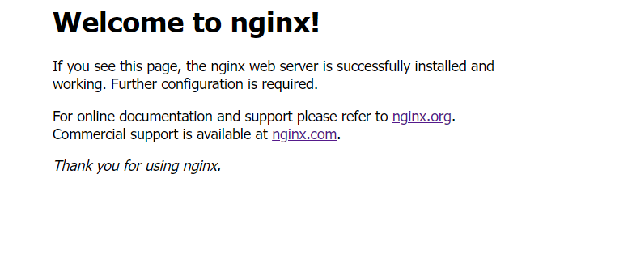

## Website deploy on CentOS 8 - Huawei Cloud

[TOC]


## 系统配置检查

检查当前华为云 CentOS 8 是否开启公网访问（ip无法直接访问）：

```bash
cat /etc/centos-release
ifconifg
vi /etc/sysconfig/network-scripts/ifcfg-eth0
vi /etc/sysconfig/network-scripts/ifcfg-eth1
vi /etc/sysconfig/network-scripts/ifcfg-eth2
vi /etc/sysconfig/network-scripts/ifcfg-eth3
yum update
```

经过检查已经开启，另外有安装 gcc 等简单工具链，由于体积原因采取最小、最简洁安装，此时需要检查各项服务是否开启、各项配置是否设置。


在公网服务器的配置当中，**最重要的当属于 Nginx 反向代理的设置**，这部分的内容在下面作为说明文档进行详细记录。


## 开发环境准备

### 安装 Nginx 1.20

由于 yum 的各种原因，只能使用下载的 `.tar.gz` 压缩包，并手动 build 出 Nginx 的二进制文件。

#### 上传 Nginx bin 文件

在 Nginx 官网下载 `nginx-1.20.2.tar.gz` 后上传到 root 用户 `~/` 目录下：

```powershell
scp ./nginx-1.20.2.tar.gz root@122.9.32.180:~/
```


解压到 `/usr/local/` 目录下：

```bash
tar -zxvf  nginx-1.20.2.tar.gz
mv ./nginx-1.20.2 /usr/local/
```


#### 安装相关依赖

安装 Nginx 所需要的 pcre 依赖：

```
yum install -y pcre pcre-devel
```

此时发现报错，原因是 CentOS 8 在 2021.12.31停止了服务，会出现如下报错：

```
Repository extras is listed more than once in the configuration
Repository centosplus is listed more than once in the configuration
Repository PowerTools is listed more than once in the configuration
Repository AppStream is listed more than once in the configuration
CentOS-8 - AppStream                                                                                3.3 kB/s | 394  B     00:00
Errors during downloading metadata for repository 'AppStream':
  - Status code: 404 for https://repo.huaweicloud.com/centos-vault/centos-vault/centos/8/AppStream/x86_64/os/repodata/repomd.xml (IP: 111.206.179.20)
Error: Failed to download metadata for repo 'AppStream': Cannot download repomd.xml: Cannot download repodata/repomd.xml: All mirrors were tried
```


此时需要把默认源的 cache 文件转移到新的目录，利用中国镜像 CentOS 源重新缓存所有的软件包地址：

```bash
cd /etc/yum.repos.d/
mkdir bak
mv *.repo bak
wget -O /etc/yum.repos.d/CentOS-Base.repo https://mirrors.aliyun.com/repo/Centos-vault-8.5.2111.repo
yum clean all
yum makecache
```


更新官方源，防止国内源无法使用

```bash
[root@2022-buaa-bj-8 yum.repos.d]# vi CentOS-Linux-BaseOS.repo

[baseos]
name=CentOS Linux $releasever - BaseOS
#mirrorlist=http://mirrorlist.centos.org/?release=$releasever&arch=$basearch&repo=BaseOS&infra=$infra
#baseurl=http://mirror.centos.org/$contentdir/$releasever/BaseOS/$basearch/os/
baseurl=https://vault.centos.org/centos/$releasever/BaseOS/$basearch/os/
gpgcheck=1
enabled=1
gpgkey=file:///etc/pki/rpm-gpg/RPM-GPG-KEY-centosofficial


[root@2022-buaa-bj-8 yum.repos.d]# vi CentOS-Linux-AppStream.repo

[appstream]
name=CentOS Linux $releasever - AppStream
#mirrorlist=http://mirrorlist.centos.org/?release=$releasever&arch=$basearch&repo=AppStream&infra=$infra
#baseurl=http://mirror.centos.org/$contentdir/$releasever/AppStream/$basearch/os/
baseurl=https://vault.centos.org/centos/$releasever/AppStream/$basearch/os/
gpgcheck=1
enabled=1
gpgkey=file:///etc/pki/rpm-gpg/RPM-GPG-KEY-centosofficial
```


下一步正常安装所有需要的软件包，顺便升级一下系统的一些小组件：

```bash
yum install -y pcre pcre-devel zlib zlib-devel
yum update
```


#### 默认配置启动 Nginx

进行安装配置，首先使用默认配置：

```bash
./configure
make
make install
cd ../nginx/sbin/
./nginx
```


这个时候应该已经启动了 Nginx 服务，可以使用下列命令行查看是否已经启动：

```bash
ps -ef | grep nginx
```

获得以下结果，证明已经启动：

```
root       21135       1  0 12:16 ?        00:00:00 nginx: master process ./nginx
nobody     21136   21135  0 12:16 ?        00:00:00 nginx: worker process
root       21203   21170  0 12:28 pts/0    00:00:00 grep --color=auto nginx
```


此时直接从公网中访问服务器的 ip，可以看到如下界面：



将 Nginx 加入系统 root 环境变量：

```bash
vim /etc/profile
```


在打开的文件尾部加入 NGINX_HOME 变量：

```bash
export NGINX_HOME=/usr/local/nginx
export PATH=$NGINX_HOME/sbin:$PATH
```


刷新变量，系统变量 Path 被添加：

```bash
source /etc/profile
```


#### 配置 Nginx


### 安装 Git 2.35

与上面原因相同，需要手动 build 出 git 的二进制文件。


#### 上传 Git bin 文件

在 Nginx 官网下载 `nginx-1.20.2.tar.gz` 后上传到 root 用户 `~/` 目录下：

```powershell
scp ./git.tar.gz root@122.9.32.180:~/
```


解压到 `/usr/local/` 目录下：

```bash
tar -zxvf git-2.35.3.tar.gz
mv ./git-2.35.3 /usr/local/
```


#### 安装依赖

一定记得安装依赖，要不然没有办法和 remote 链接：

```bash
yum install -y libcurl-devel
```


#### 手动安装 Git

分为：配置安装路径，编译，安装 三步。

```bash
cd /usr/local/git-2.35.3
./configure --prefix=/usr/local/git
make
make install
```


将 Git 加入系统 root 环境变量：

```bash
vim /etc/profile
```


在打开的文件尾部加入 GIT_HOME 变量：

```bash
export GIT_HOME=/usr/local/git
export PATH=$GIT_HOME/bin:$PATH
```


刷新变量，系统变量 Path 被添加：

```bash
source /etc/profile
```


很遗憾，华为云的 Git 无法访问到 `github.com`，只能通过本地的 **SFTP** 文件服务，或 `scp` 指令将本地的所有文件一起发上去，很鸡肋。


### 配置 Python 3.6.8

CentOS 8 最新安装的版本为 **Python 3.6.8**，不影响使用，不过习惯要改下，`python` 指令为 `python3`，`pip` 指令为 `pip3`。


#### 直接 pip 安装包

```bash
pip3 install -r ~/Project/backend/requirements.txt
```

注意，没有启用虚拟环境。


#### 尝试启动后端 Django 项目

Django 后端项目默认启用 8000 端口运行。

```bash
python3 ~/Project/backend/src/mysite/manage.py runserver (8000)
```


### 安装 npm

直接安装 centOS 8 最新的 node.js 10.24.0-1 发现版本不够，只能手动下载。


#### yum 安装不可行

```bash
yum install npm
npm -v
npm install npm -g
```


**！但你发现依然不行**，在安装 `@vue/cli@5.0.4` 时候提示如下信息：

```
You are using Node v10.24.0, but this version of @vue/cli requires Node ^12.0.0 || >= 14.0.0.
Please upgrade your Node version.
```


无奈之下只能再次去官网下载 bin 文件，并上传到服务器解压使用：

```bash
scp ./node-v16.14.2-linux-x64.tar.xz root@122.9.32.180:~/
```


CentOS 端进行两步解压获得 node-v16.14.2 安装目录，并移动到统一安装目录：


```bash
xz -d node-v16.14.2-linux-x64.tar.xz
tar xvf node-v16.14.2-linux-x64.tar
mv node-v16.14.2-linux-x64/ /usr/local/
```


将 Git 加入系统 root 环境变量：

```bash
vim /etc/profile
```


在打开的文件尾部加入 NODE_HOME 变量：

```bash
export NODE_HOME=/usr/local/node-v16.14.2-linux-x64
export PATH=$NODE_HOME/bin:$PATH
```


刷新变量，系统变量 Path 被添加：

```bash
source /etc/profile
```


#### 更新环境、换源、安装相关依赖

```bash
npm install -g npm@8.7.0
npm set registry https://registry.npm.taobao.org/
npm install -g @vue/cli
```


查询 vue2 脚手架工具版本，正常结果应显示为 `@vue/cli 5.0.4`：

```bash
vue --version
```


#### 尝试启动 vue2 项目

尝试在 `~/Project/frontend` 目录下使用 vue2 工具进行 build 操作：

```bash
npm install
npm run build  # can skip
npm run dev
```

经过测试，可以正常运行！

