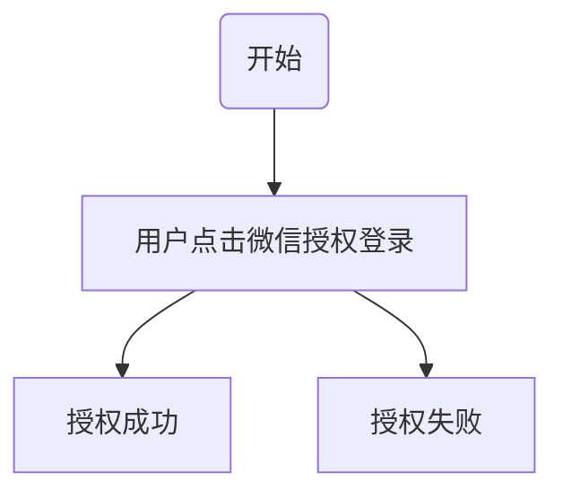
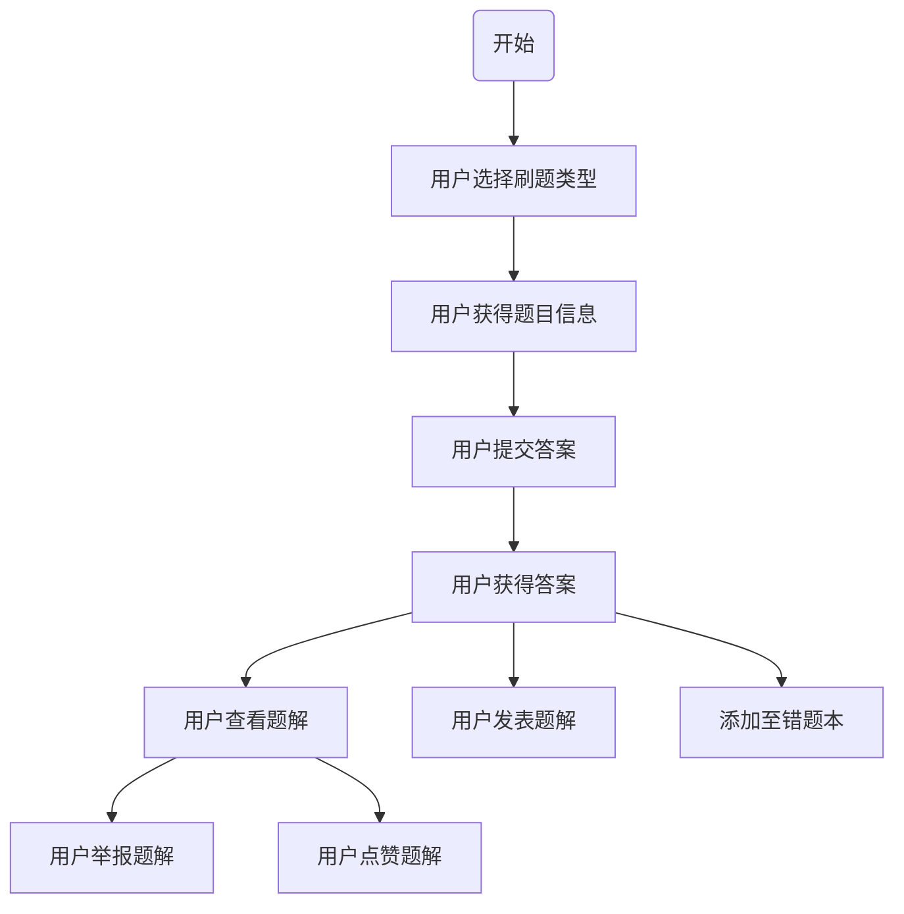
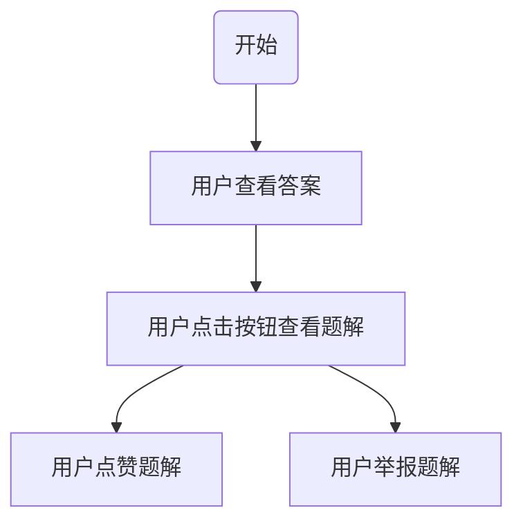
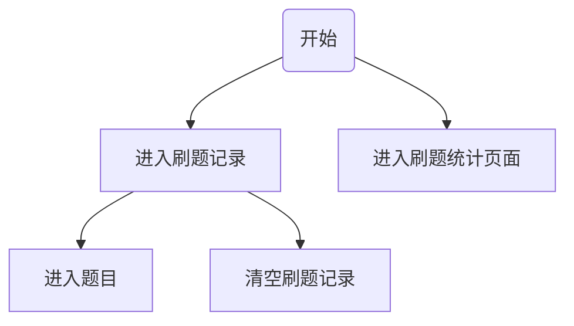
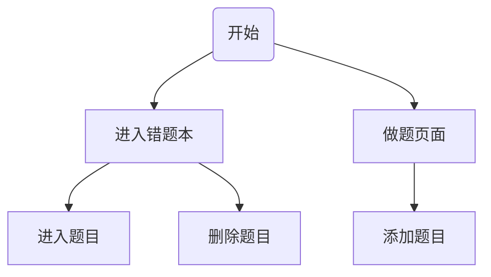
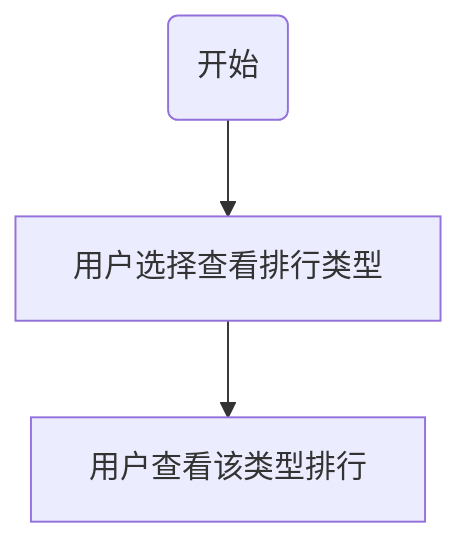

# Newbee English英语学习平台设计文档

[TOC]

## 1版本历史

| 日期       | 版本  | 人员                                             | 更新内容                                         |
| ---------- | ----- | ------------------------------------------------ | ------------------------------------------------ |
| 2022.04.7  | V0.01 | 李霄龙 姜田龙 张昊雨 赵润晶                      | 后端创建api参考文档                              |
| 2022.04.10 | V0.02 | 李霄龙 姜田龙 张昊雨 赵润晶 李肇嘉               | 完成web前端设计文档撰写                          |
| 2022.04.13 | V0.03 | 徐乐陶 杨佳豪                                    | 完成小程序前端设计文档撰写                       |
| 2022.04.14 | V0.10 | 李霄龙 姜田龙 张昊雨 徐乐陶 赵润晶 李肇嘉 杨佳豪 | 三部分文档合并以及文档介绍的撰写，并发布最终版本 |

## 2文档介绍

### 2.1文档目的

​	此报告是北京学院Newbee English团队，关于所构架的Newbee English英语学习平台编写的设计报告。主要服务于有意使用本平台的各种人群和团体，参与评审的上级单位，以及可能的未来将接替我们的项目并继续加以完成的后辈们。

​	文档对于项目的各功能进行了解释整理分类，并依次对于其实现的逻辑，具体细节进行了说明，描述了每一个实现所使用的接口的数据形式。使用别个展示了整个项目的 数据库结构。 

​	编者希望通过这本报告，读者能快速了解整个项目的背景，软件的基本情况，具体功能设计的方案，各种接口的细节以及数据库的设计。从而对我团队所完成的工作有一 个大致的了解，进而能迅速地投入项目的后续开发。 

​	关于本项目的其他内容，请参考另外三本手册，分别是Newbee English需求说明文档、 Newbee English测试报告以及Newbee English用户使用说明书。

### 2.2文档范围

​	Newbee English系统 web 端和 小程序APP 端的所有功能的实现设计，接口设计，数据结构设计。

### 2.3读者对象

​	有意向使用本系统的各种人群和团体，参与评审的上级单位，以及可能的未来将接替我们的项目并继续加以完善的其他开发者。

### 2.4参考文献

[1]OmniSci 团队，《需求规格说明书》，北航计算机学院，2019.03.18 

[2]OmniSci 团队，《测试报告》，北航计算机学院，2019.05.18. 

[3]OmniSci 团队，《用户使用说明书》，北航计算机学院，2019.06.01. 

[4]Szegedy C , Vanhoucke V , Ioffe S , et al. [IEEE 2016 IEEE Conference on Computer  Vision and Pattern Recognition (CVPR) - Las Vegas, NV, USA (2016.6.27-2016.6.30)] 2016  IEEE Conference on Computer Vision and Pattern Recognition (CVPR) - Rethinking the  Inception Architecture for Computer Vision[J]. 2016:2818-2826.

[5]Newbee English团队，《需求规格说明书》，北航北京学院。

[6] [SE-BSsystem](https://github.com/HK-vv/SE-BSsystem/)

## 3 用户信息管理功能(A)

| 子功能名称                     | 子功能代号 | 描述                                                         |
| ------------------------------ | ---------- | ------------------------------------------------------------ |
| 管理员账号登录功能             | A1         | 管理员填写账号密码进行登录。                                 |
| 管理员账号登出功能             | A2         | 管理员点击登出按钮即可登出，跳转到登录界面                   |
| 展示并查询用户信息功能         | A3         | 管理员可直接浏览所有小程序用户的信息，并支持根据用户名进行筛选 |
| 删除用户账号功能（可批量删除） | A4         | 管理员可以删除用户账号                                       |
| 添加用户信息功能               | A5         | 管理员可以添加用户信息                                       |

### 3.1 功能 A1 实现

#### 3.1.1 功能简述

管理端支持管理员登录功能。登录时需验证用户名和密码，前端对是否输入用户名，密码和用户名是否大于两个字符进行验证，如用户名输入框失去焦点后无信息存留，则提示请输入用户名。若用户名输入框失去焦点后不足两个字符，则提示用户名请大于两个字符。若密码输入框失去焦点后取信息存留则显示请输入密码。如输入的用户名和密码信息正确则进入系统，否则给出错误信息提示。

#### 3.1.2 功能实现流程

```flow
st=>start: 开始
op=>operation: 输入用户名或密码
op2=>operation: 点击登录按钮
cond=>condition: 验证用户名和密码
op3=>operation: 登录成功
op4=>operation: 登录失败
e=>end: 结束

st->op->op2->cond
cond(yes)->op3->e
cond(no)->op4(right)->op

```


#### 3.1.3 用户界面设计

**登录**

| 序号 | 类型   | 信息内容     | 信息表现 | 说明                               |
| ---- | ------ | ------------ | -------- | ---------------------------------- |
| 1    | 输入框 | 用户名输入框 | 字符提示 | 输入已创建的用户名，显示在登录框中 |
| 2    | 输入框 | 密码输入框   | 字符提示 | 输入对应密码，显示在登录框中       |
| 3    | 按钮   | 登录         | 按钮提示 | 点击后可进入系统，显示在登录框中   |

#### 3.1.4 相关接口

| 序号 | 类型 | 接口名称              | 来源/文档编号 | 说明         |
| ---- | ---- | --------------------- | ------------- | ------------ |
| 1    | 内部 | /api/admin/auth/login | 11.2.1        | 获取登录信息 |

#### 3.1.5 异常处理

**登录**

| 序号 | 错误编码  | 错误信息                 | 说明/处理办法                                                |
| ---- | --------- | ------------------------ | ------------------------------------------------------------ |
| 1    | A-01-E-01 | 未输入用户名             | 用户名输入框失去焦点后无输入信息，提示请输入用户名           |
| 2    | A-01-E-02 | 输入的用户名少于两个字符 | 用户名输入框失去焦点后信息少于两个字符，提示用户名大于两个字符 |
| 2    | A-01-E-03 | 未输入密码               | 密码输入框失去焦点后无输入信息，提示请输入密码               |
| 4    | A-01-E-04 | 用户名或密码错误         | 点击登录后检测到用户名或密码密码错误，提示用户名或密码错误   |

### 3.2 功能 A2 实现

#### 3.2.1 功能简述

管理端具有管理员登出功能。登出时，点击系统顶栏“退出登录”按钮，系统提示欢迎下次登录，并跳转到登录界面。

#### 3.2.2 功能实现流程

```flow
st=>start: 开始
op=>operation: 点击顶栏退出登录按钮
op2=>operation: 跳转到登录界面
e=>end: 结束

st->op->op2->e

```

#### 3.2.3 用户界面设计

**登出**

| 序号 | 类型 | 信息内容 | 信息表现 | 说明                           |
| ---- | ---- | -------- | -------- | ------------------------------ |
| 1    | 按钮 | 退出登录 | 按钮提示 | 点击后可退出系统，显示在顶栏中 |

#### 3.2.4 相关接口

| 序号 | 类型 | 接口名称               | 来源/文档编号 | 说明       |
| ---- | ---- | ---------------------- | ------------- | ---------- |
| 2    | 内部 | /api/admin/auth/logout | 11.2.2        | 管理员登出 |

#### 3.2.5 异常处理

| 序号 | 错误编码  | 错误信息     | 说明/处理办法                                                |
| ---- | --------- | ------------ | ------------------------------------------------------------ |
| 1    | A-02-E-01 | 登录已经失效 | 点击退出登录后检测到当前 cookie 已过期，提示登录已经失效并跳转到登录界面 |

### 3.3 功能 A3 实现

#### 3.3.1 功能简述

管理员点击用户信息管理按钮，可查询到所有用户的用户名和答题情况。管理员可以根据用户名筛选检索用户信息、选择升序或降序题目数量。

#### 3.3.2 功能实现流程

```flow
st=>start: 开始
op=>operation: 在用户管理页面查看用户信息
op2=>operation: 在搜索框输入用户ID
op3=>condition: 点击搜索显示结果
cond=>condition: 查询成功
op3=>operation: 显示查询到的用户信息
op4=>operation: 显示查询失败
e=>end: 结束

st->op->op2->cond
cond(yes)->op3->e
cond(no)->op4(right)->op
```

上图为展示用户信息，查询用户信息功能实现流程图


```flow
st=>start: 开始
op=>operation: 选择按照升序，降序排序
op2=>operation: 显示排序后的用户信息
e=>end: 结束

st->op->op2->e
```

上图为按照指定顺序展示用户信息流程图

#### 3.3.3 用户界面设计

| 序号 | 类型       | 信息内容         | 信息表现 | 说明                                                         |
| ---- | ---------- | ---------------- | -------- | ------------------------------------------------------------ |
| 1    | 文本       | 用户名           | 字符     | 用户的用户名，显示在用户信息表中                             |
| 2    | 文本       | 用户阅读数量     | 字符     | 用户的阅读题的答题数量，显示在用户信息表中                   |
| 3    | 文本       | 用户选择答题数量 | 字符     | 用户的选择题的答题数量，显示在用户信息表中                   |
| 4    | 文本       | 用户完型答题数量 | 字符     | 用户的完型题的答题数量，显示在用户信息表中                   |
| 5    | 搜索输入框 | 用户名关键字     | 字符     | 根据用户名搜索用户信息，显示在用户信息页面顶部               |
| 6    | 按钮       | 默认、升序、降序 | 按钮     | 选择用户排列方式，显示在用户信息表表头中，选择，完型，阅读均有对应按钮 |

#### 3.3.4 相关接口

| 序号 | 类型 | 接口名称               | 来源/文档编号 | 说明         |
| ---- | ---- | ---------------------- | ------------- | ------------ |
| 1    | 内部 | /api/admin/manage_user | 11.2.3        | 列出用户账号 |

#### 3.3.5 异常处理

| 序号 | 错误编码  | 错误信息 | 说明/处理办法                                                |
| ---- | --------- | -------- | ------------------------------------------------------------ |
| 1    | A-03-E-01 | 登录失效 | 操作后检测到当前 cookie 已过期，提示登录失效并跳转到登录界面 |

### 3.4 功能 A4 实现

#### 3.4.1 功能简述

管理员点击需要删除的用户账户信息后面的删除按钮，并再次确认后即可删除。勾选需要删除的用户，点击批量删除按钮，并再次确认后即可对勾选的用户进行批量删除。

#### 3.4.2 功能实现流程

```flow
st=>start: 开始
cond=>condition: 是否批量删除
op=>operation: 勾选要删除的用户
op1=>operation: 点击用户后面的删除按钮
op2=>operation: 点击批量删除按钮
op3=>operation: 确认删除
e=>end: 结束

st->cond
cond(yes)->op->op2->op3->e
cond(no)->op1->op3->e
```

#### 3.4.3 用户界面设计

| 序号 | 类型 | 信息内容     | 信息表现 | 说明                 |
| ---- | ---- | ------------ | -------- | -------------------- |
| 1    | 按钮 | 删除         | 按钮提示 | 选择删除该用户       |
| 2    | 按钮 | 批量删除按钮 | 按钮提示 | 选择批量删除用户     |
| 3    | 文本 | 确认信息     | 字符提示 | 提示是否确认删除用户 |
| 4    | 按钮 | 确认/取消    | 按钮提示 | 选择是否确认删该用户 |

#### 3.4.4 相关接口

| 序号 | 类型 | 接口名称               | 来源/文档编号 | 说明         |
| ---- | ---- | ---------------------- | ------------- | ------------ |
| 1    | 内部 | /api/admin/manage_user | 11.2.4        | 删除用户账号 |

#### 3.4.5 异常处理

| 序号 | 错误编码  | 错误信息 | 说明/处理办法                                                |
| ---- | --------- | -------- | ------------------------------------------------------------ |
| 1    | A-04-E-01 | 登录失效 | 操作后检测到当前 cookie 已过期，提示登录失效并跳转到登录界面 |

### 3.5 功能 A5 实现

#### 3.5.1 功能简述

管理员可点击用户信息页面顶部添加按钮添加用户信息。

#### 3.5.2 功能实现流程

```flow
st=>start: 开始
op=>operation: 点击用户信息页面顶部添加用户按钮
op1=>operation: 填写添加的用户信息
op2=>operation: 确认添加
e=>end: 结束

st->op->op1->op2->e
```


#### 3.5.3 用户界面设计

| 序号 | 类型   | 信息内容  | 信息表现 | 说明                         |
| ---- | ------ | --------- | -------- | ---------------------------- |
| 1    | 按钮   | 添加      | 按钮提示 | 点击添加按钮即可弹出添加页面 |
| 2    | 文本框 | 用户名    | 字符     | 待添加的用户名               |
| 3    | 密码框 | 密码      | 按钮     | 待添加的密码                 |
| 4    | 密码框 | 重复密码  | 字符     | 再次输入待添加的密码         |
| 5    | 按钮   | 确认      | 选项     | 选择添加该用户               |
| 6    | 文本   | 确认信息  | 选项     | 提示是否确认添加该用户       |
| 7    | 按钮   | 确认/取消 | 按钮提示 | 选择是否添加该用户           |

#### 3.5.4 相关接口

| 序号 | 类型 | 接口名称                | 来源/文档编号 | 说明     |
| ---- | ---- | ----------------------- | ------------- | -------- |
| 1    | 内部 | /api/admin/user_account | 11.2.5        | 添加用户 |

#### 3.5.5 异常处理

| 序号 | 错误编码  | 错误信息 | 说明/处理办法                                                |
| ---- | --------- | -------- | ------------------------------------------------------------ |
| 1    | A-05-E-01 | 登录失效 | 操作后检测到当前 cookie 已过期，提示登录失效并跳转到登录界面 |

## 4 题库管理功能(B)

| 子功能名称                 | 子功能代号 | 描述                                                         |
| -------------------------- | ---------- | ------------------------------------------------------------ |
| 题目添加功能               | B1         | 管理员可以单个添加题目                                       |
| 题目筛选和查看功能         | B2         | 管理员可以根据题目的不同类型对题目进行筛选或直接查看当前题库中全部题目 |
| 查看题目详情信息和题解功能 | B3         | 管理员可点击题目标题查看题目详情                             |
| 题解删除功能               | B4         | 管理员可以对题解进行删除                                     |
| 题目删除功能（可批量删除） | B5         | 管理员可以单个或批量删除题目                                 |
| 题目编辑功能               | B6         | 管理员可以对题目的信息进行编辑                               |

### 4.1 功能 B1 实现

#### 4.1.1 功能简述

管理员可根据该功能实现题目添加操作，添加题目时需在题库管理界面，点击添加题目按钮， 在下面表单中填写题目类型、题目文章、子题目数量，点击“确定”按钮，即可根据子题目数量出现若干个子题目信息也。 每个子题目信息也包括子题目题干，子题目选项，子题目答案等信息。

#### 4.1.2 功能实现流程

```flow
st=>start: 开始
op=>operation: 点击对应题型的题目管理页面
op1=>operation: 点击添加题目按钮
op2=>operation: 填写题目和子题目信息
op3=>operation: 确认添加
e=>end: 结束

st->op->op1->op2->op2->e
```

#### 4.1.3 用户界面设计

| 序号 | 类型       | 信息内容   | 信息表现 | 说明                                       |
| ---- | ---------- | :--------- | -------- | ------------------------------------------ |
| 1    | 下拉选项框 | 题目类型   | 字符提示 | 共有选择，完型，阅读三种选项               |
| 2    | 输入框     | 题目文章   | 字符提示 | 阅读、完形的文章，选择题此项为空           |
| 3    | 输入框     | 子题目数量 | 字符提示 | 子题目的数量                               |
| 4    | 按钮       | 确认       | 按钮提示 | 是否确认题目的基本信息，开始输入子题目信息 |
| 5    | 输入框     | 子题目题面 | 字符提示 | 子题目的题面，在子题目信息页               |
| 6    | 输入框     | 子题目选项 | 字符提示 | 子题目的选项，在子题目信息页               |
| 7    | 输入框     | 子题目答案 | 字符提示 | 子题目的答案，在子题目信息页               |
| 8    | 按钮       | 确认按钮   | 按钮提示 | 确认添加题目                               |
| 9    | 按钮       | 取消按钮   | 按钮提示 | 取消添加题目                               |

#### 4.1.4 相关接口

| 序号 | 类型 | 接口名称                 | 来源/文档编号 | 说明     |
| ---- | ---- | ------------------------ | ------------- | -------- |
| 1    | 内部 | POST /api/admin/question | 11.2.8        | 上传题目 |

#### 4.1.5 异常处理

| 序号 | 错误编码  | 错误信息           | 说明/处理办法                                                |
| ---- | --------- | ------------------ | ------------------------------------------------------------ |
| 1    | B-01-E-01 | 缺少类型           | 若类型框未选择，则提示请选择类型                             |
| 2    | B-01-E-02 | 子题目数量不为数字 | 子题目数量输入框失去焦点后不为数字，则提示请输入正确的子题目数量 |
| 3    | B-01-E-03 | 缺少子题目数量     | 子题目数量输入框失去焦点后没有信息留存，则提示请输入子题目数量 |
| 4    | B-01-E-04 | 缺少子题目选项     | 子题目选项输入框失去焦点后没有信息留存，则提示请输入子题目选项 |
| 5    | B-01-E-05 | 缺少子题目答案     | 子题目答案输入框失去焦点后没有信息留存，则提示请输入子题目答案 |
| 6    | B-01-E-06 | 登录失效           | 操作后检测到当前 cookie 已过期，提示登录失效并跳转到登录界面 |

### 4.2 功能 B2 实现

#### 4.2.1 功能简述

管理员可根据该功能进行题目筛选和题目查看。管理员可直接在题库管理界面对当前题库中指定类型的所有题目信息进行查看。也可根据题目 id对当前题库中的题目进行筛选。

#### 4.2.2 功能实现流程

```flow
st=>start: 开始
op=>operation: 在题库管理页面查看题目信息
op2=>operation: 在搜索框输入题目ID
op3=>condition: 点击搜索显示结果
cond=>condition: 查询成功
op3=>operation: 显示查询到的题目信息
op4=>operation: 显示查询失败
e=>end: 结束

st->op->op2->cond
cond(yes)->op3->e
cond(no)->op4(right)->op
```


#### 4.2.3 用户界面设计

| 序号 | 类型   | 信息内容   | 信息表现 | 说明                                           |
| ---- | ------ | ---------- | -------- | ---------------------------------------------- |
| 1    | 输入框 | 题目 id    | 字符提示 | 根据题目的ID搜索题目，显示在题目信息页面的顶部 |
| 3    | 文本   | 题目标题   | 字符提示 | 题目的标题，显示题目信息表中                   |
| 4    | 文本   | 子题目数量 | 字符提示 | 题目的子题目数量，显示题目信息表中             |

#### 4.2.4 相关接口

| 序号 | 类型 | 接口名称            | 来源/文档编号 。 | 说明               |
| ---- | ---- | ------------------- | ---------------- | ------------------ |
| 1    | 内部 | /api/admin/question | 11.2.6           | 管理员查看题目列表 |

#### 4.2.5 异常处理

| 序号 | 错误编码  | 错误信息 | 说明/处理办法                                                |
| ---- | --------- | -------- | ------------------------------------------------------------ |
| 1    | B-02-E-01 | 登录失效 | 操作后检测到当前 cookie 已过期，提示登录失效并跳转到登录界面 |

### 4.3 功能 B3 实现

#### 4.3.1 功能简述

管理员可根据该功能，点击题目标题即可进行题目详细信息查看。根据子题目的数量不同，会出现不同数量的子题目详细信息。

#### 4.3.2 功能实现流程

```flow
st=>start: 开始
op=>operation: 点击题目标题跳转到题目详情
op1=>operation: 显示题目信息，子题目信息和题解
e=>end: 结束

st->op->op1->e

```


#### 4.3.3 用户界面设计

| 序号 | 类型 | 信息内容   | 信息表现 | 说明                                       |
| ---- | ---- | ---------- | -------- | ------------------------------------------ |
| 1    | 文本 | 题目标题   | 字符提示 | 题目的标题，显示题目信息表中               |
| 2    | 文本 | 子题目数量 | 字符提示 | 题目的子题目数量，显示在题目详细信息页面中 |
| 3    | 文本 | 子题目题面 | 字符提示 | 题目的子题目题面，显示在题目详细信息页面中 |
| 4    | 文本 | 子题目选项 | 字符提示 | 题目的子题目选项，显示在题目详细信息页面中 |
| 5    | 文本 | 子题目标题 | 字符提示 | 题目的子题目标题，显示在题目详细信息页面中 |
| 6    | 文本 | 子题目题解 | 字符提示 | 题目的子题目题解，显示在题目详细信息页面中 |

#### 4.3.4 相关接口

| 序号 | 类型 | 接口名称            | 来源/文档编号 | 说明                   |
| ---- | ---- | ------------------- | ------------- | ---------------------- |
| 1    | 内部 | /api/admin/question | 11.2.7        | 管理员查看题目详细信息 |

#### 4.3.5 异常处理

| 序号 | 错误编码  | 错误信息 | 说明/处理办法                                                |
| ---- | --------- | -------- | ------------------------------------------------------------ |
| 1    | B-03-E-01 | 登录失效 | 操作后检测到当前 cookie 已过期，提示登录失效并跳转到登录界面 |

### 4.4 功能 B4 实现

#### 4.4.1 功能简述

管理员可利用该功删除题目的子题目所对应的题解，管理员可以直接在题目详细信息页面中选择需要删除的子题目题解，并点击“删除”按钮，在确认对话框中再次确认后，即可对相应题目进行删除。

#### 4.4.2 功能实现流程

```flow
st=>start: 开始
op=>operation: 点击题目标题跳转到题目详情
op1=>operation: 显示题目信息，子题目信息和题解
op2=>operation: 点击对应题解后的删除按钮
op3=>operation: 确认删除题解
e=>end: 结束

st->op->op1->op2->op3->e
```


#### 4.4.3 用户界面设计

| 序号 | 类型 | 信息内容   | 信息表现 | 说明                   |
| ---- | ---- | ---------- | -------- | ---------------------- |
| 1    | 按钮 | 删除该题解 | 按钮提示 | 选择要删除的子题目题解 |
| 1    | 文本 | 确认信息   | 字符提示 | 提示是否确认删除该题解 |
| 2    | 按钮 | 确认/取消  | 按钮提示 | 选择是否确认删除该题解 |

#### 4.4.4 相关接口

| 序号 | 类型 | 接口名称                | 来源/文档编号 | 说明     |
| ---- | ---- | ----------------------- | ------------- | -------- |
| 1    | 内部 | /api/admin/que_solution | 11.2.11       | 删除题解 |

#### 4.4.5 异常处理

| 序号 | 错误编码  | 错误信息 | 说明/处理办法                                                |
| ---- | --------- | -------- | ------------------------------------------------------------ |
| 1    | B-04-E-01 | 登录失效 | 操作后检测到当前 cookie 已过期，提示登录失效并跳转到登录界面 |

### 4.5功能 B5 实现

#### 4.5.1 功能简述

管理员可利用该功删除所选题目，管理员可以直接在题目管理页面中选择需要删除的题目，并点击“删除”按钮，在确认对话框中再次确认后，即可对相应题目进行删除。勾选题目前对应的多选按钮，并点击批量删除按钮即可批量删除题目。

#### 4.5.2 功能实现流程

```flow
st=>start: 开始
op=>operation: 选择对应类型的题目管理页面
op1=>operation: 显示题目信息
cond=>condition: 是否批量删除
op2=>operation: 点击对应题目后的删除按钮
op3=>operation: 勾选需要删除的题目
op4=>operation: 点击批量删除按钮
op5=>operation: 确认删除题目
e=>end: 结束

st->op->op1->cond
cond(yes)->op3->op4->op5->e
cond(no)->op2->op5->e
```


#### 4.5.3 用户界面设计

| 序号 | 类型         | 信息内容   | 信息表现 | 说明                 |
| ---- | ------------ | ---------- | -------- | -------------------- |
| 1    | 按钮         | 删除该题目 | 按钮提示 | 选择要删除的题目     |
| 2    | 批量删除按钮 | 删除题目   | 按钮提示 | 批量删除题目         |
| 3    | 文本         | 确认信息   | 字符提示 | 提示是否确认删除题目 |
| 4    | 按钮         | 确认/取消  | 按钮提示 | 选择是否确认删除题目 |

#### 4.5.4 相关接口

| 序号 | 类型 | 接口名称            | 来源/文档编号 | 说明     |
| ---- | ---- | ------------------- | ------------- | -------- |
| 1    | 内部 | /api/admin/question | 11.2.10       | 删除题目 |

#### 4.5.5 异常处理

| 序号 | 错误编码  | 错误信息 | 说明/处理办法                                                |
| ---- | --------- | -------- | ------------------------------------------------------------ |
| 1    | B-05-E-01 | 登录失效 | 操作后检测到当前 cookie 已过期，提示登录失效并跳转到登录界面 |

### 4.6 功能 B6 实现

#### 4.6.1 功能简述

管理员可使用该功能对题目进行编辑，管理员可以在题库管理界面点击相应题目，进入题目详细页面狗，点击“编辑”按钮，即可对所选题目的题目文章、子题目题面、子题目选项、子题目答案中的任一或多个属性信息进行修改 

#### 4.6.2 功能实现流程

```flow
st=>start: 开始
op=>operation: 点击题目标题跳转到题目详情
op1=>operation: 点击编辑题目按钮
op2=>operation: 编辑题目和子题目信息
op3=>operation: 确认更改
e=>end: 结束

st->op->op1->op2->op3->e
```


#### 4.6.3 用户界面设计

| 序号 | 类型   | 信息内容   | 信息表现 | 说明                 |
| ---- | ------ | ---------- | -------- | -------------------- |
| 1    | 输入框 | 题目文章   | 字符提示 | 需要修改的题目的文章 |
| 2    | 输入框 | 子题目题面 | 字符提示 | 需要修改的子题目题面 |
| 3    | 输入框 | 子题目选项 | 字符提示 | 需要修改的子题目选项 |
| 4    | 输入框 | 子题目答案 | 字符提示 | 需要修改的子题目答案 |
| 5    | 文本   | 确认信息   | 字符提示 | 提示是否确认更改题目 |
| 6    | 按钮   | 确认/取消  | 按钮提示 | 选择是否确认更改题目 |

#### 4.6.4 相关接口

| 序号 | 类型 | 接口名称         | 来源/文档编号 | 说明     |
| ---- | ---- | ---------------- | ------------- | -------- |
| 1    | 内部 | POST /api/admin/ | 11.2.9        | 修改题目 |

#### 4.6.5 异常处理

| 序号 | 错误编码  | 错误信息       | 说明/处理办法                                                |
| ---- | --------- | -------------- | ------------------------------------------------------------ |
| 1    | B-06-E-01 | 缺少题目文章   | 题目文章输入框失去焦点后信息存留，且题目类型不为选择，则提示请输入题目文章 |
| 2    | B-06-E-02 | 缺少子题目题面 | 子题目题目输入框失去焦点后信息存留，且题目类型不为完型，则提示请输入子题目题面 |
| 3    | B-06-E-03 | 缺少子题目选项 | 子题目选项输入框失去焦点后信息存留，提示请输入子题目选项     |
| 4    | B-06-E-04 | 缺少子题目答案 | 子题目答案输入框失去焦点后信息存留，提示请输入子题目答案     |
| 5    | B-06-E-05 | 缺少题目信息   | 点击提交按钮后检测到以上任何一个错误存在，则提示请输入正确的题目信息 |
| 6    | B-06-E-06 | 登录失效       | 操作后检测到当前 cookie 已过期，提示登录失效并跳转到登录界面 |

## 5 公告发布功能(C)

| 子功能名称   | 子功能代号 | 描述                                 |
| ------------ | ---------- | ------------------------------------ |
| 公告查看公告 | C1         | 管理员查看当前公告                   |
| 公告修改功能 | C2         | 管理员可以根据更新信息或表彰修改公告 |

### 5.1 功能 C1 实现

#### 5.1.1 功能简述

管理员可根据该功能实现查看公告内容

#### 5.1.2 功能实现流程

```flow
st=>start: 开始
op=>operation: 点击公告管理按钮
op1=>operation:  看现存的公告内容
e=>end: 结束
st->op->op1->e
```


#### 5.1.3 公告查看界面设计

| 序号 | 类型   | 信息内容       | 信息表现 | 说明           |
| ---- | ------ | :------------- | -------- | -------------- |
| 1    | 标题   | 公告管理标题   | 字符提示 | 无             |
| 2    | 文本框 | 现存的公告内容 | 字符提示 | 现存的公告内容 |

#### 5.1.4 相关接口

| 序号 | 类型 | 接口名称          | 来源/文档编号 | 说明           |
| ---- | ---- | ----------------- | ------------- | -------------- |
| 1    | 内部 | /api/admin/notice | 11.2.12       | 管理员查看公告 |

#### 5.1.5 异常处理

| 序号 | 错误编码  | 错误信息 | 说明/处理办法                                                |
| ---- | --------- | -------- | ------------------------------------------------------------ |
| 1    | C-01-E-01 | 登录失效 | 操作后检测到当前 cookie 已过期，提示登录失效并跳转到登录界面 |

### 5.2 功能 C2 实现

#### 5.2.1 功能简述

管理员可以根据当前版本更新或表彰优秀学生，更改在用户端显示的公告，公告可以设置发布的日期与时间，可以一键删除当前公告，快捷设置默认公告等功能。

#### 5.2.2 功能实现流程

```flow
st=>start: 开始
cond=>condition: 是否选择默认公告
op=>operation: 点击默认公告按钮设置默认公告
op1=>operation: 在公告栏内编辑新的公告
op2=>operation: 选择发布公告的时间，日期
cond2=>condition: 是否提交公告
op3=>operation: 确认删除
op4=>operation: 确认提交
e=>end: 结束

st->cond
cond(yes)->op->cond2
cond(no)->op1->op2->cond2
cond2(yes,left)->op3->cond
cond2(no,bottom)->op4->e
```


#### 5.2.3 公告修改界面设计

| 序号 | 类型   | 信息内容     | 信息表现 | 说明               |
| ---- | ------ | :----------- | -------- | ------------------ |
| 1    | 标题   | 公告管理标题 | 字符提示 | 无                 |
| 2    | 输入框 | 公告内容     | 字符提示 | 准备发布的公告内容 |
| 3    | 选择框 | 发布公告日期 | 按钮提示 | 选择发布公告的日期 |
| 4    | 选择框 | 发布公告时间 | 按钮提示 | 选择发布公告的时间 |
| 5    | 按钮   | 默认公告输入 | 按钮提示 | 设置默认公告       |
| 6    | 按钮   | 删除当前输入 | 按钮提示 | 选择删除当前公告   |
| 7    | 按钮   | 确认删除     | 按钮提示 | 确定删除当前公告   |
| 8    | 按钮   | 取消删除     | 按钮提示 | 取消删除当前公告   |
| 9    | 按钮   | 提交按钮     | 按钮提示 | 提交公告           |

#### 5.2.4 相关接口

| 序号 | 类型 | 接口名称          | 来源/文档编号 。 | 说明           |
| ---- | ---- | ----------------- | ---------------- | -------------- |
| 1    | 内部 | /api/admin/notice | 11.2.13          | 管理员修改公告 |

#### 5.2.5 异常处理

| 序号 | 错误编码  | 错误信息     | 说明/处理办法                                                |
| ---- | --------- | ------------ | ------------------------------------------------------------ |
| 1    | C-02-E-01 | 提交空白公告 | 发出提示，不得提交空白公                                     |
| 1    | C-02-E-02 | 登录失效     | 操作后检测到当前 cookie 已过期，提示登录失效并跳转到登录界面 |

## 6用户登录功能（A）

#### 6.1功能简述

用户端支持用户登录功能。登录时需要通过点击小程序中的按钮进行微信授权，授权后由小程序中直接获取用户名（即微信昵称）和头像（即微信头像）并在用户信息页面进行显示，同时将用户信息传递给后端。若成功授权则会在界面显示成功登录，若为成功则会显示授权错误。

#### 6.2功能实现流程




#### 6.3界面设计

| 序号 | 类型 | 信息内容     | 信息表现 | 说明                 |
| ---- | ---- | ------------ | -------- | -------------------- |
| 1    | 按钮 | 微信授权登录 | 按钮提示 | 点击后可登录进入系统 |

#### 6.4相关接口

| 序号 | 类型 | 接口名称       | 来源/文档编号 | 说明         |
| ---- | ---- | -------------- | ------------- | ------------ |
| 1    | 内部 | api/user/login | 11.3.1        | 获取登录信息 |

#### 6.5异常处理

| 序号 | 错误编码  | 错误信息     | 说明/处理办法                      |
| ---- | --------- | ------------ | ---------------------------------- |
| 1    | A-01-E-01 | 微信授权失败 | 授权过程中退出或取消，提示授权失败 |

## 7 用户答题功能（B）

| 子功能名称       | 子功能代号 | 描述                             |
| ---------------- | ---------- | -------------------------------- |
| 获取题目页面功能 | B1         | 用户可以在刷题页面获取题目       |
| 获取题目答案功能 | B2         | 用户可以在提交答案后获取题目答案 |
| 查看题解功能     | B3         | 用户可以在获取题目答案后查看题解 |
| 发表题解功能     | B4         | 用户可以在获取题目答案后发表题解 |
| 举报题解功能     | B5         | 用户可以在查看题解后举报题解     |
| 点赞题解功能     | B6         | 用户可以在查看题解后点赞题解     |

#### 功能实现流程



### 7.1 功能 B1 实现

#### 7.1.1 功能简述

用户可以在该页面进行答题类型选择。

#### 7.1.2 功能实现流程

#### 7.1.3 用户界面设计

| 序号 | 类型 | 信息内容         | 信息表现 | 说明                        |
| ---- | ---- | ---------------- | -------- | --------------------------- |
| 1    | 按钮 | 单项选择         | 按钮提示 | 点击后进入单项选择题目页面  |
| 2    | 按钮 | 完形填空         | 按钮提示 | 点击后进入完形填空题目页面  |
| 3    | 按钮 | 阅读理解         | 按钮提示 | 点击后进入阅读理解题目页面1 |
| 1    | 文本 | 请选择练习的类型 | 文本提示 | 无                          |

#### 7.1.4 相关接口

| 序号 | 类型 | 接口名称 | 来源/文档编号 | 说明 |
| ---- | ---- | -------- | ------------- | ---- |
| 1    |      |          |               |      |

#### 7.1.5 异常处理

| 序号 | 错误编码 | 错误信息 | 说明/处理办法 |
| ---- | -------- | -------- | ------------- |
| 1    |          |          |               |

### 7.2 功能 B2 实现

#### 7.2.1 功能简述

用户可以在选择完题目类型后进入刷题页面开始刷题，用户选择选项，点击提交后答案显示。

#### 7.2.2 功能实现流程

```flow
st=>start: 选择题目类型
op=>operation: 点击题目类型跳转到对应类型题目
op1=>operation: 显示题目信息
op2=>operation: 用户提交选项
op3=>operation: 显示答案
e=>end: 结束

st->op->op1->op2->op3->e
```


#### 7.2.3 用户界面设计

| 序号 | 类型 | 信息内容      | 信息表现 | 说明                   |
| ---- | ---- | ------------- | -------- | ---------------------- |
| 1    | 按钮 | 查看题目      | 按钮提示 | 查看题目与选项         |
| 1    | 文本 | 文章/题目内容 | 字符提示 | 显示文章的内容         |
| 2    | 按钮 | 提交          | 按钮提示 | 确认提交选项并查看答案 |

| 序号 | 类型 | 信息内容 | 信息表现 | 说明                           |
| ---- | ---- | -------- | -------- | ------------------------------ |
| 1    | 按钮 | 查看题解 | 按钮提示 | 查看题解                       |
| 1    | 文本 | 答案内容 | 字符提示 | 显示答案的内容                 |
| 2    | 按钮 | 返回题目 | 按钮提示 | 用户可以再看答案时返回查看题目 |
| 3    | 按钮 | 下一题   | 按钮提示 | 点击进入下一题                 |
| 4    | 按钮 | 发表题解 | 按钮提示 | 进入发表题解页面               |

#### 7.2.4 相关接口

| 序号 | 类型 | 接口名称                     | 来源/文档编号 | 说明         |
| ---- | ---- | ---------------------------- | ------------- | ------------ |
| 1    | 外部 | GET /api/user/get_question   | 11.3.9        | 获取题目题面 |
| 1    | 外部 | GET /api/user/check_question | 11.3.10       | 获取题目答案 |

#### 7.2.5 异常处理

| 序号 | 错误编码  | 错误信息         | 说明/处理办法                                          |
| ---- | --------- | ---------------- | ------------------------------------------------------ |
| 1    | B-02-E-01 | 请求题目内容失败 | 请求题目内容失败导致无法获得题目内容，显示题目请求失败 |

### 7.3 功能 B3 实现

#### 7.3.1 功能简述

用户可以在查看答案后点击查看题解按钮查看题解，查看题解后可以举报或点赞题解。

#### 7.3.2 功能实现流程




#### 7.3.3 用户界面设计

| 序号 | 类型 | 信息内容 | 信息表现 | 说明           |
| ---- | ---- | -------- | -------- | -------------- |
| 1    | 按钮 | 举报题解 | 按钮提示 | 举报题解       |
| 1    | 文本 | 题解内容 | 字符提示 | 显示题解的内容 |
| 2    | 按钮 | 点赞题解 | 按钮提示 | 点赞题解       |

#### 7.3.4 相关接口

| 序号 | 类型 | 接口名称                           | 来源/文档编号 | 说明       |
| ---- | ---- | ---------------------------------- | ------------- | ---------- |
| 1    | 外部 | GET /api/user/que_solution         | 11.3.11       | 查看题解   |
| 1    | 外部 | PATCH /api/user/que_soluton_like   | 11.3.13       | 为题解点赞 |
| 1    | 外部 | PATCH /api/user/que_soluton_report | 11.3.14       | 举报题解   |

#### 7.3.5 异常处理

| 序号 | 错误编码  | 错误信息                | 说明/处理办法 |
| ---- | --------- | ----------------------- | ------------- |
| 1    | B-02-E-01 | 请求题解失败/本题无题解 | 显示无题解    |

### 7.4 功能 B4 实现

#### 7.4.1 功能简述

用户可以在选择完题目类型后进入刷题页面开始刷题，用户选择选项，点击提交后答案显示。

#### 7.4.2 功能实现流程

```flow
st=>start: 开始
op=>operation: 撰写题解
op1=>operation: 提交题解
e=>end: 结束

st->op->op1->e
```


#### 7.4.3 用户界面设计

| 序号 | 类型 | 信息内容   | 信息表现 | 说明         |
| ---- | ---- | ---------- | -------- | ------------ |
| 1    | 按钮 | 返回       | 按钮提示 | 放弃写题解   |
| 1    | 文本 | 请撰写题解 | 字符提示 | 提示用户     |
| 2    | 按钮 | 提交       | 按钮提示 | 确认提交题解 |

#### 7.4.4 相关接口

| 序号 | 类型 | 接口名称                    | 来源/文档编号 | 说明     |
| ---- | ---- | --------------------------- | ------------- | -------- |
| 1    | 外部 | POST /api/user/que_solution | 11.3.12       | 发表题解 |

#### 7.4.5 异常处理

| 序号 | 错误编码  | 错误信息 | 说明/处理办法    |
| ---- | --------- | -------- | ---------------- |
| 1    | B-04-E-01 | 题解为空 | 提示用户内容为空 |

## 8 刷题记录功能（C)

| 子功能名称           | 子功能代号 | 描述                             |
| :------------------- | ---------- | -------------------------------- |
| 查看刷题记录功能     | C1         | 用户可以查看近期的刷题记录       |
| 查看刷题统计功能     | C2         | 由后端提供刷题记录的分析在此显示 |
| 用户清空刷题统计功能 | C3         | 用户选择清空所有刷题记录         |

### 8.1 功能 C1 实现

#### 8.1.1 功能简述

用户可通过“我的”界面查看刷题记录，该记录按照时间排序，可选择查看的题目类型，分为

#### 8.1.2 功能实现流程



#### 8.1.3 界面设计

| 序号 | 类型 | 信息内容 | 信息表现 | 说明                                                       |
| ---- | ---- | -------- | -------- | ---------------------------------------------------------- |
| 1    | 按钮 | 历史记录 | 按钮提示 | 在“我的”页面中，可点击进入刷题记录                         |
| 2    | 按钮 | 题目信息 | 按钮提示 | 点击后进入刷过的题目                                       |
| 3    | 按钮 | 题目类型 | 按钮提示 | 可在此处选择题目类型，包括单向选择、完型填空、阅读理解三种 |
| 4    | 按钮 | 清空     | 按钮提示 | 显示窗口再次确认是否清空历史记录                           |

#### 8.1.4 相关接口

| 序号 | 类型 | 接口名称               | 来源/文档编号 | 说明             |
| ---- | ---- | ---------------------- | ------------- | ---------------- |
| 1    | 内部 | api/user/record        | 11.3.6        | 请求查看刷题记录 |
| 2    | 内部 | api/user/record_delete | 11.3.8        | 清空刷题记录     |

#### 8.1.5 异常处理

| 序号 | 错误编码  | 错误信息         | 说明/处理办法                              |
| ---- | --------- | ---------------- | ------------------------------------------ |
| 1    | C-01-E-01 | 无法查看刷题记录 | 刷题记录为空，或者连接错误，提示做题或重试 |


### 8.2 功能 C2 实现

#### 8.2.1 功能简述

#### 8.2.2 功能实现流程

见8.3.1.2

#### 8.2.3 界面设计

| 序号 | 类型 | 信息内容       | 信息表现 | 说明                                 |
| ---- | ---- | -------------- | -------- | ------------------------------------ |
| 1    | 按钮 | 刷题记录统计   | 按钮提示 | 进入刷题记录统计页面                 |
| 2    | 图像 | 各题型统计图像 | 图像     | 呈现根据用户刷题记录计算出的统计数据 |

#### 8.2.4 相关接口

| 序号 | 类型 | 接口名称             | 来源/文档编号 | 说明         |
| ---- | ---- | -------------------- | ------------- | ------------ |
| 1    | 内部 | /api/user/statistics | 11.3.7        | 调用刷题数据 |

#### 8.2.5 异常处理

| 序号 | 错误编码  | 错误信息         | 说明/处理办法                          |
| ---- | --------- | ---------------- | -------------------------------------- |
| 1    | D-02-E-01 | 无法查看统计记录 | 无法进入记录统计页面，提示重试         |
| 2    | D-02-E-02 | 查看统计数据错误 | 未调用到刷题记录统计信息，提示连接错误 |

## 9 错题本功能（D)

| 子功能名称           | 子功能代号 | 描述                                                     |
| :------------------- | ---------- | -------------------------------------------------------- |
| 查看错题本功能       | D1         | 用户可直接浏览错题本中的题目                             |
| 向错题本添加题目功能 | D2         | 错误的题目自动加入错题本，用户也可以手动将做对的题目加入 |
| 删除错题本中题目功能 | D3         | 用户可以删除错题本中已添加的题目                         |

### 9.1 功能 D1 实现

#### 9.1.1 功能简述

用户可以在“我的”页面点击按钮进入错题本以查看错题。

#### 9.1.2 功能实现流程



 

#### 9.1.3 界面设计

| 序号 | 类型 | 信息内容 | 信息表现 | 说明             |
| ---- | ---- | -------- | -------- | ---------------- |
| 1    | 按钮 | 错题本   | 按钮提示 | 查看错题本       |
| 2    | 按钮 | 题目信息 | 按钮提示 | 进入相关题目     |
| 3    | 按钮 | 返回     | 按钮提示 | 从题目返回错题本 |

#### 9.1.4 相关接口

| 序号 | 类型 | 接口名称                | 来源/文档编号 | 说明       |
| ---- | ---- | ----------------------- | ------------- | ---------- |
| 1    | 内部 | api/user/wrong_que_book | 11.3.3        | 查看错题本 |

#### 9.1.5 异常处理

| 序号 | 错误编码  | 错误信息       | 说明/处理办法            |
| ---- | --------- | -------------- | ------------------------ |
| 1    | D-01-E-01 | 未能找到错题本 | 连接错误，无法进入错题本 |

### 9.2 功能 D2 实现

#### 9.2.1 功能简述

除了做错的题目会自动加入错题本以外，用户也1可以手动将没有做错的题目加入错题本。

#### 9.2.2 功能实现流程

见9.2.1.2

#### 9.2.3 界面设计

| 序号 | 类型 | 信息内容   | 信息表现 | 说明                 |
| ---- | ---- | ---------- | -------- | -------------------- |
| 1    | 按钮 | 加入错题本 | 按钮提示 | 将相关题目加入错题本 |

#### 9.2.4 相关接口

| 序号 | 类型 | 接口名称                | 来源/文档编号 | 说明             |
| ---- | ---- | ----------------------- | ------------- | ---------------- |
| 1    | 内部 | api/user/wrong_que_book | 11.3.4        | 将题目加入错题本 |

#### 9.2.5 异常处理

| 序号 | 错误编码  | 错误信息     | 说明/处理办法                    |
| ---- | --------- | ------------ | -------------------------------- |
| 1    | D-02-E-01 | 添加错题失败 | 未能将题目加入错题本，提示请重试 |


### 9.3 功能 D3 实现

#### 9.3.1 功能简述

用户可以在错题本中将不需要的题目删除。

#### 9.3.2 功能实现流程

见8.2.1.2

#### 9.3.3 界面设计

| 序号 | 类型 | 信息内容 | 信息表现 | 说明                 |
| ---- | ---- | -------- | -------- | -------------------- |
| 1    | 按钮 | 删除     | 按钮提示 | 将错题本中的题目删除 |

#### 9.3.4 相关接口

| 序号 | 类型 | 接口名称                | 来源/文档编号 | 说明           |
| ---- | ---- | ----------------------- | ------------- | -------------- |
| 1    | 内部 | api/user/wrong_que_book | 11.3.5        | 删除错题本的题 |

#### 9.3.5 异常处理

| 序号 | 错误编码  | 错误信息     | 说明/处理办法                        |
| ---- | --------- | ------------ | ------------------------------------ |
| 1    | D-03-E-01 | 删除错题失败 | 未能将题目从错题本中删除，提示请重试 |

## 10 用户查看排名功能（E）

| 子功能名称   | 子功能代号 | 描述           |
| ------------ | ---------- | -------------- |
| 查看排名功能 | E1         | 查看用户排名   |
| 查看公告功能 | E2         | 查看管理员公告 |

#### 功能实现流程



### 10.1 功能 E1 实现

#### 10.1.1 功能简述

用户可以选择题目类型后查看排行。

#### 10.1.2 功能实现流程

```flow
st=>start: 开始
op=>operation: 选择查看排行的题目类型
op1=>operation: 查看排行
e=>end: 结束

st->op->op1->e
```


#### 10.1.3 用户界面设计

| 序号 | 类型 | 信息内容       | 信息表现 | 说明                     |
| ---- | ---- | -------------- | -------- | ------------------------ |
| 1    | 按钮 | 完形填空排行榜 | 按钮提示 | 点击后查看完形填空排行榜 |
| 1    | 文本 | 请选择查看类型 | 字符提示 | 提示用户选择类型         |
| 2    | 按钮 | 阅读理解排行榜 | 按钮提示 | 点击后查看阅读理解排行榜 |
| 3    | 按钮 | 单项选择排行榜 | 按钮提示 | 点击后查看单项选择排行榜 |

| 序号 | 类型 | 信息内容 | 信息表现 | 说明             |
| ---- | ---- | -------- | -------- | ---------------- |
| 1    | 按钮 | 返回上页 | 按钮提示 | 点击后返回上页   |
| 1    | 文本 | 排行榜   | 字符提示 | 显示该类型排行榜 |

#### 10.1.4 相关接口

| 序号 | 类型 | 接口名称           | 来源/文档编号 | 说明     |
| ---- | ---- | ------------------ | ------------- | -------- |
| 1    | 外部 | GET /api/user/rank | 11.3.15       | 查看排名 |

#### 10.1.5 异常处理

| 序号 | 错误编码  | 错误信息 | 说明/处理办法 |
| ---- | --------- | -------- | ------------- |
| 1    | E-01-E-01 |          |               |

## 11 接口设计

本文档为 Newbee-English API 文档，参考请参见 Reference.

### 11.1 全局设置

#### 11.1.1 返回值设置(ret)

| ret值 | 含义            | 后续操作                                      | 备注                       |
| ----- | --------------- | --------------------------------------------- | -------------------------- |
| 0     | 正常            | 继续执行                                      |                            |
| 1     | 一般错误        | 返回到执行前重新执行(lxl：我认为这里有点问题) | 权限不足、查询信息不存在等 |
| 2     | 请求无sessionid | 返回登录界面                                  | 所有接口均可能返回该值     |
| 3     | 其他错误        | 查看后台报错信息尝试修复                      | 所有接口均可能返回该值     |

### 11.2 管理端

本域提到的 api 权限归于管理员。

#### 11.2.1 登录

管理员使用该接口进行登录。前端发送的登录请求中包含用户名、密码。 后端接收后，对账号密码的正确性进行校验。 如果校验通过，服务端在响应消息头使用set_cookie 存入sessionid。

##### 请求

**请求头**

```
POST /api/admin/login
Content-Type: application/json
```

**消息体**

```json
{
  "name" : "张三",
  "pwd" : "123456"
}
```

**参数信息**

| 参数名 | 示例   | 必要性 | 含义               | 类型   |
| ------ | ------ | ------ | ------------------ | ------ |
| name   | 张三   | 必有   | 管理员登录的用户名 | string |
| pwd    | 123456 | 必有   | 管理员登录的密码   | string |

##### 响应

**响应头**

```
200 OK
Content-Type: application/json
set_cookie: sessionid=<sessionid数值>
```

**消息体**

正常返回(ret=0):

```json
{
    "ret": "0"
}
```

异常返回(ret≠0):

```json
{
    "ret":"1"
}
```

**参数信息**

| 参数名 | 示例 | 必要性 | 含义         | 类型 |
| ------ | ---- | ------ | ------------ | :--- |
| ret    | 0    | 必有   | 是否正常返回 | int  |

#### 11.2.2 登出

##### 请求

**请求头**

```
DELETE /api/admin/logout
Cookie: sessionid=<sessionid数值>
```

##### 响应

后端清除对应session，然后返回响应消息。

**响应头**

```
200 OK
Content-Type: application/json
Set-Cookie: sessionid=""
```

**消息体**

正常返回(ret=0):

```json
{
  "ret": "0"
}
```

**参数信息**

| 参数名 | 示例 | 必要性 | 含义         | 类型 |
| ------ | ---- | ------ | ------------ | ---- |
| ret    | 0    | 必有   | 是否正常返回 | int  |

#### 11.2.3 查看用户信息

管理员查看用户信息。

##### 请求

**请求头**

```
GET /api/admin/manage_user?pagenumber=2&pagesize=12
Cookie: sessionid=<sessionid数值>
```

**消息体**

```json
{
  "pagenumber" : "2",
  "pagesize" : "12"
}
```

**参数信息**

| 参数名     | 示例 | 必要性 | 含义               | 类型 |
| ---------- | ---- | ------ | ------------------ | ---- |
| pagenumber | 2    | 必有   | 获取第几页的信息   | int  |
| pagesize   | 12   | 必有   | 每页列出的账号数量 | int  |

##### 响应

**响应头**

```
200 OK
Content-Type: application/json
```

**消息体**

正常返回(ret=0):

```json
{
  "ret": '0',
  "list": [{ 
    "name": "小赵",
    "numm":"888",
    "numc":"777",
    "numr":"666"
  },
  {
  "name": "小李",
  "numm":"888",
  "numc":"999",
  "numr":"555"
  }]，
  ”total":32
}
```

**参数信息**

| 参数名 | 示例    | 必要性 | 含义           | 类型info |
| ------ | ------- | ------ | -------------- | -------- |
| ret    | 0       | 必有   | 是否正常返回   | int      |
| list   | [{},{}] | 必有   | 所有用户的信息 | list     |
| total  | 32      | 必有   | 所有用户的数量 | int      |

其中 `list` 是包含多个查找结果的列表，每个结果的参数信息如下所示：

| 参数名 | 示例 | 必要性 | 含义     | 类型   |
| ------ | ---- | ------ | -------- | ------ |
| name   | 小赵 | 必有   | 用户名   | string |
| numm   | 888  | 必有   | 单选数量 | string |
| numc   | 777  | 必有   | 完型数量 | string |
| numr   | 666  | 必有   | 阅读数量 | string |

#### 11.2.4 删除用户信息

管理员可以通过此 api 删除用户信息

##### 请求

**请求头**

```
 DELETE /api/admin/manage_user
 Cookie: sessionid=<sessionid数值>
 Content-Type: application/json
```

**消息体**

```json
{
  "username" : "小赵"
}
```

**参数信息**

| 参数名   | 示例 | 必要性 | 含义               | 类型   |
| -------- | ---- | ------ | ------------------ | ------ |
| username | 小赵 | 必有   | 被删除账户的用户名 | string |

##### 响应

**响应头**

```
200 OK
Content-Type: application/json
```

正常返回(ret = 0):

```json
{
  "ret": 0
}
```

异常返回 (ret ≠ 0):

```json
{
"ret":'1'
}
```

**参数信息**

| 参数名 | 示例 | 必要性 | 含义         | 类型 |
| ------ | ---- | ------ | ------------ | :--- |
| ret    | 0    | 必有   | 是否正常返回 | int  |

#### 11.2.5 创建用户

管理员可根据此api创建用户

后端应做用户名重复检查。

##### 请求

**请求头**

```
PUT /api/admin/user_account
Cookie: sessionid=<sessionid数值>
Content-Type: application/json
```

**消息体**

```json
{
  "username" : "小王"
  "userpwd" : "123456"
}
```

**参数信息**

| 参数名   | 示例   | 必要性 | 含义               | 类型   |
| -------- | ------ | ------ | ------------------ | ------ |
| username | 小王   | 必有   | 创建账户时的用户名 | string |
| userpwd  | 123456 | 必有   | 创建账户时的密码   | string |

##### 响应

**响应头**

```
200 OK
Content-Type: application/json
```

**消息体**

正常返回(ret=0):

```json
{
  "ret": 0
}
```

异常返回(ret≠0):

```json
{
"ret":'1'
}
```

**参数信息**

| 参数名 | 示例 | 必要性 | 含义         | 类型 |
| ------ | ---- | ------ | ------------ | ---- |
| ret    | 0    | 必有   | 是否正常返回 | int  |

#### 11.2.6 查看题目列表

##### 请求

**请求头**

```
 GET /api/admin/question?pagenumber=2&pagesize=12&type=multiple
 Cookie: sessionid=<sessionid数值>
```

**消息体**

```json
{
  "pagenumber" : "2",
  "pagesize" : "12",
  "type":"multiple"
}
```

**参数信息**

| 参数名     | 示例     | 必要性 | 含义               | 类型   |
| ---------- | -------- | ------ | ------------------ | ------ |
| pagenumber | 2        | 必有   | 获取第几页的信息   | int    |
| pagesize   | 12       | 必有   | 每页列出的题目数量 | int    |
| type       | multiple | 必有   | 要查看题目的类型   | string |

##### 响应

**响应头**

```
200 OK
Content-Type: application/json
```

**消息体**

正常返回(ret=0):

```json
{
  "ret": '0',
  "list": [{ 
    "text": "Lily was so ___looking at the picture that she forgot the time",
    "sub_que_num":"2",
  },
  {
    "text": "Lily was so ___looking at the picture that she forgot the time",
    "sub_que_num":"3",
  }]，
  ”total":32
}
```

**参数信息**

| 参数名 | 示例    | 必要性 | 含义                   | 类型info |
| ------ | ------- | ------ | ---------------------- | -------- |
| ret    | 0       | 必有   | 是否正常返回           | int      |
| list   | [{},{}] | 必有   | 某个类型所有题目的信息 | list     |
| total  | 32      | 必有   | 某个类型题目的总数量   | int      |

其中`list`是包含多个查找结果的列表，每个结果的参数信息如下所示：

| 参数名      | 示例                                                         | 必要性 | 含义                                      | 类型   |
| ----------- | ------------------------------------------------------------ | ------ | ----------------------------------------- | ------ |
| text        | Lily was so ___looking at the picture that she forgot the time | 必有   | 阅读/完型文章第一句话或单选子题目第一句话 | string |
| sub_que_num | 2                                                            | 必有   | 所含小题数量                              | int    |

#### 11.2.7 查看题目信息

##### 请求

**请求头**

```
 POST /api/admin/question
 Cookie: sessionid=<sessionid数值>
```

**消息体**

```json
{
  "ID" : "2",
}
```

**参数信息**

| 参数名 | 示例 | 必要性 | 含义             | 类型   |
| ------ | ---- | ------ | ---------------- | ------ |
| ID     | 2    | 必有   | 被查看的题目的ID | string |

##### 响应

**响应头**

```
200 OK
Content-Type: application/json
```

**消息体**

正常返回(ret=0):

```json
{
  "ret": '0',
   "text":"",
  "sub_que_num":2，
  sub_que[
  {
      "stem":"Lily was so ___looking at the picture that she forgot the time."
      "options":[
        "carefully",
        "careful",
        "busily",
        "busy"
      ],
      "answer": "B"，
      answer key:["这个题的关键在于认真审题"，"站在父亲的角度来就可以更好的理解本题"]
  },
  {
      "stem":"Lily was so ___looking at the picture that she forgot the time."
      "options":[
        "carefully",
        "careful",
        "busily",
        "busy"
      ],
      "answer": "B"，
      answer key:["这个题的关键在于认真审题"，"站在父亲的角度来就可以更好的理解本题"]
  }，
}
```

**参数信息**

| 参数名      | 示例    | 必要性 | 含义                             | 类型info |
| ----------- | ------- | ------ | -------------------------------- | -------- |
| ret         | 0       | 必有   | 是否正常返回                     | int      |
| text        | " "     | 可选   | 阅读、完形的文章，选择题此项为空 | string   |
| sub_que_num | 4       | 必有   | 子题目数目                       | int      |
| sub_que     | [{},{}] | 必有   | 子题目的信息                     | list     |

其中sub_que是包含多个子题目信息的列表，每个子题目信息的参数信息如下所示：

| 参数名     | 示例                                                         | 必要性 | 含义                       | 类型   |
| ---------- | ------------------------------------------------------------ | ------ | -------------------------- | ------ |
| "stem"     | Lily was so ___looking at the picture that she forgot the time. | 可选   | 子题目的题面，完型此项为空 | string |
| options    | ["carefully","careful", "busily","busy"]                     | 必有   | 选项                       | list   |
| answer     | "B"                                                          | 必有   | 答案                       | string |
| answer key | ["认真审题"，"站在父亲的角度来就可以更好的理解第二小题"]     | 可选   | 子题目的题解               | list   |

#### 11.2.8 上传题目

##### 请求

**请求头**

```
 POST /api/admin/question
 Cookie: sessionid=<sessionid数值>
 Content-Type: application/json
```

**消息体**

```json
{
  "type": "multiple",
  "text":"",
  "sub_que_num":2，
  sub_que[
  {
      "stem":"Lily was so ___looking at the picture that she forgot the time."
      "options":[
        "carefully",
        "careful",
        "busily",
        "busy"
      ],
      "answer": "B"
  },
  {
      "stem":"Lily was so ___looking at the picture that she forgot the time."
      "options":[
        "carefully",
        "careful",
        "busily",
        "busy"
      ],
      "answer": "B"
  }
  ]
}
```

**参数信息**

| 参数名      | 示例                                          | 必要性 | 含义                             | 类型   |
| ----------- | --------------------------------------------- | ------ | -------------------------------- | ------ |
| type        | "multiple" / "cloze" / "readingcomprehension" | 必有   | 题目类型                         | string |
| text        | " "                                           | 可选   | 阅读、完形的文章，选择题此项为空 | string |
| sub_que_num | 4                                             | 必有   | 子题目数目                       | int    |
| sub_que     | [{},{}]                                       | 必有   | 子题目的信息                     | list   |

其中sub_que是包含多个子题目信息的列表，每个子题目信息的参数信息如下所示：

| 参数名  | 示例                                                         | 必要性 | 含义                       | 类型   |
| ------- | ------------------------------------------------------------ | ------ | -------------------------- | ------ |
| "stem"  | Lily was so ___looking at the picture that she forgot the time. | 可选   | 子题目的题面，完型此项为空 | string |
| options | ["carefully","careful", "busily","busy"]                     | 必有   | 选项                       | list   |
| answer  | "B"                                                          | 必有   | 答案                       | string |

##### 响应

**响应头**

```
200 OK
Content-Type: application/json
```

**消息体**

正常返回(ret = 0):

```json
{
  "ret": 0
}
```

异常返回(ret≠0):

```json
{
"ret":'1'
}
```

**参数信息**

| 参数名 | 示例 | 必要性 | 含义         | 类型 |
| ------ | ---- | ------ | ------------ | ---- |
| ret    | 0    | 必有   | 是否正常返回 | int  |

#### 11.2.9 修改题目

管理员可通过此api修改题目

##### 请求

**请求头**

```
POST /api/admin/
Cookie: sessionid=<sessionid数值>
Content-Type: application/json
```

**消息体**

```json
{
  "problemid": 1,
  "newdata": {  
      text:" "
      sub_que[
          {
              "stem":"Lily was so ___looking at the picture that she forgot the time."
              "options":[
                "carefully",
                "careful",
                "busily",
                "busy"
              ],
              "answer": "B"
          },
          {
              "stem":"Lily was so ___looking at the picture that she forgot the time."
              "options":[
                "carefully",
                "careful",
                "busily",
                "busy"
              ],
              "answer": "B"
          }
          ]
}
```

**参数信息**

| 参数名    | 示例 | 必要性 | 含义           | 类型       |
| --------- | ---- | ------ | -------------- | ---------- |
| problemid | 1    | 必有   | 题目id         | int        |
| newdata   | { }  | 必有   | 需要修改的信息 | dictionary |

其中`newdata`中的参数信息如下所示：

| 参数名  | 示例    | 必要性 | 含义                             | 类型   |
| ------- | ------- | ------ | -------------------------------- | ------ |
| text    | ' '     | 可选   | 阅读、完形的文章，选择题此项为空 | string |
| sub_que | [{},{}] | 可选   | 子题目的信息                     | list   |

其中`sub_que`中的参数信息如下所示：

| 参数名  | 示例                                                         | 必要性 | 含义                       | 类型   |
| ------- | ------------------------------------------------------------ | ------ | -------------------------- | ------ |
| "stem"  | Lily was so ___looking at the picture that she forgot the time. | 可选   | 子题目的题面，完型此项为空 | string |
| options | ["carefully","careful", "busily","busy"]                     | 可选   | 选项                       | list   |
| answer  | "B"                                                          | 可选   | 答案                       | string |

##### 响应

**响应头**

```
200 OK
Content-Type: application/json
```

**消息体**

正常返回(ret = 0):

```json
{
  "ret": 0
}
```

异常返回(ret ≠ 0):

```json
{
  "ret": 1
}
```

**参数信息**

| 参数名 | 示例 | 必要性 | 含义         | 类型 |
| ------ | ---- | ------ | ------------ | ---- |
| ret    | 0    | 必有   | 是否正常返回 | int  |

#### 11.2.10 删除题目

管理员可通过此api删除题目

##### 请求

**请求头**

```
DELETE /api/admin/question
Cookie: sessionid=<sessionid数值>
Content-Type: application/json
```

**消息体**

```json
{
  "question": [
    11,
    21
  ]
}
```

**参数信息**

| 参数名   | 示例 | 必要性 | 含义               | 类型 |
| -------- | ---- | ------ | ------------------ | ---- |
| question | [ ]  | 必有   | 需要被删除的题目id | list |

##### 响应

**响应头**

```
200 OK
Content-Type: application/json
```

**消息体**

正常返回(ret = 0):

```json
{
  "ret": 0
}
```

异常返回(ret ≠ 0):

```json
{
  "ret": 1
}
```

**参数信息**

| 参数名 | 示例 | 必要性 | 含义         | 类型 |
| ------ | ---- | ------ | ------------ | ---- |
| ret    | 0    | 必有   | 是否正常返回 | int  |

#### 11.2.11 删除题解

##### 请求

**请求头**

```
 DELETE /api/admin/que_solution
 Cookie: sessionid=<sessionid数值>
```

**消息体**

```json
{
  "id" : "3"
}
```

**参数信息**

| 参数名 | 示例 | 必要性 | 含义           | 类型   |
| ------ | ---- | ------ | -------------- | ------ |
| id     | 3    | 必有   | 被删除的题解ID | string |

##### 响应

**响应头**

```
200 OK
Content-Type: application/json
```

正常返回(ret=0):

```json
{
  "ret": 0
}
```

异常返回(ret≠0):

```json
{
"ret":'1'
}
```

**参数信息**

| 参数名 | 示例 | 必要性 | 含义         | 类型 |
| ------ | ---- | ------ | ------------ | :--- |
| ret    | 0    | 必有   | 是否正常返回 | int  |

#### 11.2.12 查看公告

##### 请求

**请求头**

```
 POST /api/admin/notice
 Cookie: sessionid=<sessionid数值>
```

##### 响应

**响应头**

```
200 OK
Content-Type: application/json
```

**消息体**

正常返回(ret=0)

```json
{
  ret:0
  "ancontent" : "welcome to NewBee English"
}
```

异常返回(ret ≠ 0):

```json
{
  "ret": 1
}
```

**参数信息**

| 参数名    | 示例        | 必要性 | 含义         | 类型   |
| --------- | ----------- | ------ | ------------ | ------ |
| ret       | 1           | 必有   | 是否正常返回 | int    |
| ancontent | welcom to.. | 必有   | 公告内容     | string |

#### 11.2.13 修改公告

##### 请求

**请求头**

```
 PUT /api/admin/notice
 Cookie: sessionid=<sessionid数值>
```

**消息体**

```json
{
  "ancontent" : "welcome to NewBee English"
  "antime": { 
    "year": "2022",
    "month":"5",
    "day":"9",
    "hour":"14"
    "min":"23",
    "sec":"25"
  }
}
```

**参数信息**

| 参数名    | 示例        | 必要性 | 含义     | 类型       |
| --------- | ----------- | ------ | -------- | ---------- |
| ancontent | welcom to.. | 必有   | 公告内容 | string     |
| ant       | {}          | 必有   | 发布时间 | dictionary |

其中`ant`中的参数信息如下所示：

| 参数名 | 示例 | 必要性 | 含义     | 类型 |
| ------ | ---- | ------ | -------- | ---- |
| year   | 2022 | 必有   | 发布年份 | int  |
| month  | 5    | 必有   | 发布月份 | int  |
| day    | 9    | 必有   | 发布天   | int  |
| hour   | 14   | 必有   | 发布小时 | int  |
| min    | 23   | 必有   | 发布分钟 | int  |
| sec    | 25   | 必有   | 发布秒   | int  |

##### 响应

**响应头**

```
200 OK
Content-Type: application/json
```

**消息体**

正常返回(ret=0):

```json
{
  "ret": 0
}
```

异常返回(ret≠0):

```json
{
  "ret":'1'
}
```

**参数信息**

| 参数名 | 示例 | 必要性 | 含义         | 类型 |
| ------ | ---- | ------ | ------------ | ---- |
| ret    | 0    | 必有   | 是否正常返回 | int  |

### 11.3 用户端

本块提到的 api 权限归于用户。

#### 11.3.1 登录

##### 请求

**请求头**

```
 POST /api/user/login
```

##### 响应

**响应头**

```
200 OK
Content-Type: application/json
set_cookie: sessionid=<sessionid数值>
```

#### 11.3.2 查看昵称

##### 请求

**请求头**

```
 GET /api/user/profile
 Cookie: sessionid=<sessionid数值>
```

##### 响应

**响应头**

```
200 OK
Content-Type: application/json
```

#### 11.3.3 查看错题本

##### 请求

**请求头**

```
 GET /api/user/wrong_que_book
 Cookie: sessionid=<sessionid数值>
```

##### 响应

**响应头**

```
200 OK
Content-Type: application/json
```

#### 11.3.4 向错题本添加错题

##### 请求

**请求头**

```
 POST /api/user/wrong_que_book
 Cookie: sessionid=<sessionid数值>
```

##### 响应

**响应头**

```
200 OK
Content-Type: application/json
```

#### 11.3.5 删除错题本中的题

##### 请求

**请求头**

```
 DELETE /api/user/wrong_que_book
 Cookie: sessionid=<sessionid数值>
```

##### 响应

**响应头**

```
200 OK
Content-Type: application/json
```

#### 11.3.6 查看刷题记录

##### 请求

**请求头**

```
 GET /api/user/record
 Cookie: sessionid=<sessionid数值>
```

##### 响应

**响应头**

```
200 OK
Content-Type: application/json
```

#### 11.3.7 查看刷题统计

##### 请求

**请求头**

```
 GET /api/user/statistics
 Cookie: sessionid=<sessionid数值>
```

##### 响应

**响应头**

```
200 OK
Content-Type: application/json
```

#### 11.3.8 用户清空刷题统计

##### 请求

**请求头**

```
 DELETE /api/user/statistics
 Cookie: sessionid=<sessionid数值>
```

##### 响应

**响应头**

```
200 OK
Content-Type: application/json
```

#### 11.3.9 获取题目题面

待定：用户既可以随机获取题目，也可指定获取某道题，“指定获取”或许可用在错题本和刷题记录上

##### 请求

**请求头**

```
 GET /api/user/get_question
 Cookie: sessionid=<sessionid数值>
```

##### 响应

**响应头**

```
200 OK
Content-Type: application/json
```

#### 11.3.10 获取题目答案

##### 请求

**请求头**

```
 GET /api/user/check_question
 Cookie: sessionid=<sessionid数值>
```

##### 响应

**响应头**

```
200 OK
Content-Type: application/json
```

#### 11.3.11 查看题解

##### 请求

**请求头**

```
 GET /api/user/que_solution
 Cookie: sessionid=<sessionid数值>
```

##### 响应

**响应头**

```
200 OK
Content-Type: application/json
```

#### 11.3.12 发表题解

##### 请求

**请求头**

```
 POST /api/user/que_solution
 Cookie: sessionid=<sessionid数值>
```

##### 响应

**响应头**

```
200 OK
Content-Type: application/json
```

#### 11.3.13 为题解点赞

##### 请求

**请求头**

```
 PATCH /api/user/que_soluton_like
 Cookie: sessionid=<sessionid数值>
```

##### 响应

**响应头**

```
200 OK
Content-Type: application/json
```

#### 11.3.14 举报题解

##### 请求

**请求头**

```
 PATCH /api/user/que_soluton_report
 Cookie: sessionid=<sessionid数值>
```

##### 响应

**响应头**

```
200 OK
Content-Type: application/json
```

#### 11.3.15 查看排名

前端需要提供参数供后端查询，参数包括题目类型

##### 请求

**请求头**

```
 GET /api/user/rank
 Cookie: sessionid=<sessionid数值>
```

##### 响应

**响应头**

```
200 OK
Content-Type: application/json
```

#### 11.3.16 查看公告

##### 请求

**请求头**

```
 GET /api/user/notice
 Cookie: sessionid=<sessionid数值>
```

##### 响应

**响应头**

```
200 OK
Content-Type: application/json
```


------

#### Reference:

We cannot generate this doc without exsiting help from project list below:

  [SE-BSsystem](https://github.com/HK-vv/SE-BSsystem/)


