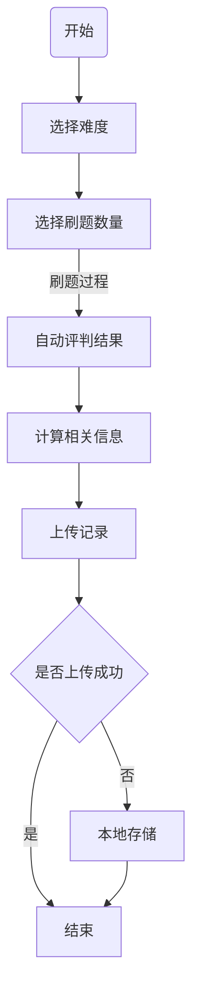
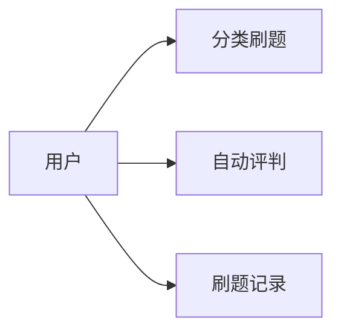
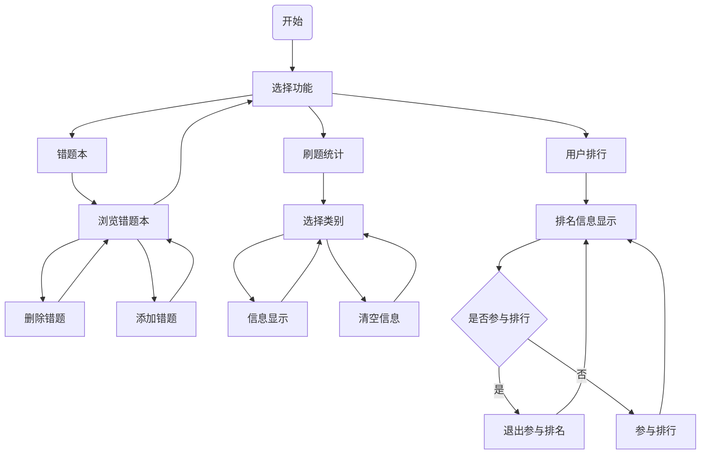
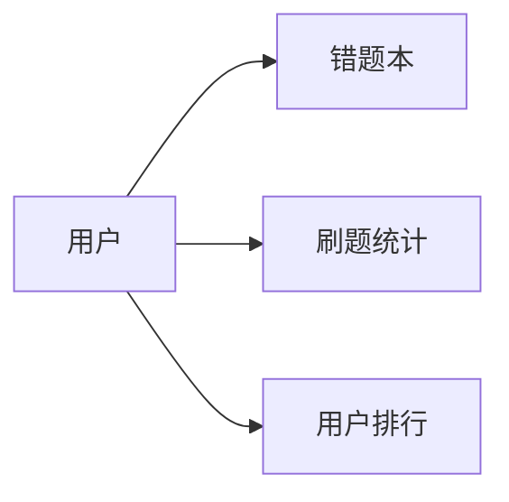

# 英语学习平台

## 1 版本历史

| 日期       | 版本  | 人员                                             | 更新内容                                                     |
| ---------- | ----- | ------------------------------------------------ | ------------------------------------------------------------ |
| 2022.03.23 | V0.10 | 李霄龙 姜田龙 张昊雨 徐乐陶 赵润晶 李肇嘉 杨佳豪 | 创建文档及目录，后端组大致完成任务，但仍有部分错误没有修订，图片风格没有统一 |
|            |       |                                                  |                                                              |
|            |       |                                                  |                                                              |
|            |       |                                                  |                                                              |
|            |       |                                                  |                                                              |
|            |       |                                                  |                                                              |
|            |       |                                                  |                                                              |
|            |       |                                                  |                                                              |
|            |       |                                                  |                                                              |

## 2 前言？（目的，适用人群等）

## 3 项目概述

## 4 功能性需求

### 	4.1 用户信息管理功能

#### 4.1.1 业务流程

#### 4.1.2 用例图

#### 4.1.3 功能点

##### 4.1.3.1 功能描述

###### 1、注册功能

用户直接微信授权注册即可。

用户名默认为微信号，头像默认为微信头像。

###### 2、登录功能

用户直接微信授权登录。

管理员在网页端需要账号密码登录。

###### 3、登出功能

此功能只针对管理端，就是退出登录，跳转到登录界面。

###### 4、用户信息展示功能

可在个人中心查看用户名、头像，还包括用户成绩分析、错题本等。

###### 5、用户信息修改功能

可修改用户名、头像，编辑错题本等。

用户名的约束规则与微信号一致，不能以数字开头，可以使用6-20位字母、数字、下划线或减号组合而成，不支持中文。

##### 4.1.3.2 使用角色描述

| 角色   | 权限                         |
| ------ | ---------------------------- |
| 管理员 | 可以查看和修改所有用户的信息 |
| 用户   | 仅可以查看和修改自己的信息   |

##### 4.1.3.3 管理端输入

| 数据名称 | 数据格式               |
| -------- | ---------------------- |
| 账号     | 与微信号设置格式一致   |
| 密码     | 与微信密码设置格式一致 |

##### 4.1.3.4 用户端和管理端输出

| 模块             | 输出内容                           |
| ---------------- | ---------------------------------- |
| 管理端登录       | 登录成功，登录失败                 |
| 用户端注册和登录 | 注册/登录成功， 注册/登录失败      |
| 用户信息展示     | 用户名、头像，成绩分析、错题本入口 |
| 用户信息修改     | 修改成功，修改失败                 |

### 	4.2 题库管理系统

#### 4.2.1 业务流程

#### 4.2.2 用例图

#### 4.2.3 功能点

##### 4.2.3.1 功能描述

###### 1、题目上传

只允许管理员操作，支持文本格式的题目上传，可选择题目难度与题型。系统为每个种类的提供题目模板供管理员填写，但并非完全手动录入每个题目选项。

###### 2、题目编辑

管理员在上传题目后，仍可修改题目的题干、答案、题目难度、题型等。

###### 3、题目删除

管理员可删除已经上传的题目。

##### 4.2.3.2 使用角色描述

| 使用者 | 功能                         |
| ------ | ---------------------------- |
| 管理员 | 题目上传、题目编辑、题目删除 |

##### 4.2.3.3  异常操作流程

上传、编辑题目时，不可出现某道题无题干、无答案等情况。管理员若填写有误，将无法提交并收到提示，可返回继续编辑。

##### 4.2.3.4 输入

| 数据名称       | 数据格式 |
| -------------- | -------- |
| 阅读、完型文章 | 文本     |
| 阅读题干描述   | 文本     |
| 题干选项       | 文本     |
| 答案           | 单选框   |

##### 4.2.3.5 输出

| 功能     | 输出                         |
| -------- | ---------------------------- |
| 上传题目 | 上传题目成功，题库中加入此题 |
| 编辑题目 | 编辑题目成功，题库中更新此题 |
| 删除题目 | 删除题目成功，题库中删除此题 |

### 	4.3 刷题功能

#### 4.3.1 业务流程

#### 4.3.2 用例图

#### 4.3.3 功能点

##### 4.3.3.1 功能描述

###### 1、分类刷题功能

用户使用刷题功能时，可选单次刷题数目与难度。刷题过程中有如下信息显示：类型，用时，答对/总题数。

###### 2、自动评判功能

自动评测功能可以自动对用户提交的数据进行评判，并进行结果显示。

###### 3、刷题记录功能

后台会随时存储用户的刷题数据。

##### 4.3.3.2 使用角色描述

| 使用者 | 功能                                     |
| ------ | ---------------------------------------- |
| 用户   | 分类刷题功能、自动评判功能、刷题记录功能 |

##### 4.3.3.3  异常操作流程

分类刷题时，若题库已经被刷尽，会用户的错题、第二遍选择题库内题目进行选择。

自动评判时，若上传结果失败，先进行本地存储。

##### 4.3.3.4 输入

| 子功能模块 | 数据名称 | 数据格式   |
| ---------- | -------- | ---------- |
| 分类刷题   | 类型     | 文本       |
| 分类刷题   | 题数     | 数字       |
| 自动评判   | 类型     | 文本       |
| 自动评判   | 答对题数 | 数字       |
| 自动评判   | 总题数   | 数字       |
| 自动评判   | 用时     | 数字       |
| 自动评判   | 题号     | 字符串数组 |
| 刷题记录   | 无       | 点击       |

##### 4.3.3.5 输出

| 功能     | 输出                                         |
| -------- | -------------------------------------------- |
| 分类刷题 | 查找题目成功并显示所有返回的题、查找题目失败 |
| 自动评判 | 评判成功、提交成功                           |
| 刷题记录 | 查询刷题记录成功、查询刷题记录失败           |

### 	4.4用户成绩分析功能

#### 4.4.1 业务流程

#### 4.4.2 业务流程

#### 4.4.3 功能点

##### 4.4.3.1 功能描述

###### 1、错题本功能

每个用户的错题本可以自动记录每次刷题产生的错题。用户可以手动添加题目进入错题本，或从错题本移出题目。

###### 2、刷题统计功能

用户可以查看自己的刷题总记录，可以根据分类或所有分类通过图表显示刷题数量、正确题数、正确率，可以清除自己在某分类或所有分类的数据。

###### 3、用户排行功能

用户可以查看总体、分类的用户排名，进入板块时还会显示您在服务器的排名比。用户可以选择自己是否参与总体、分类型的排名。

##### 4.4.3.2 使用角色描述

| 使用者 | 功能                                   |
| ------ | -------------------------------------- |
| 用户   | 错题本功能、刷题统计功能、用户排行功能 |

##### 4.4.3.3  异常操作流程

无

##### 4.4.3.4 输入

| 子功能模块 | 数据名称 | 数据格式 |
| ---------- | -------- | -------- |
| 错题本     | 类型     | 文本     |
| 错题本     | 题号     | 字符串   |
| 错题本     | 操作     | 文本     |
| 刷题统计   | 请求     | 点击     |
| 用户排行   | 操作     | 文本     |
| 用户排行   | 请求     | 点击     |

##### 4.4.3.5 输出

| 功能     | 输出                                                         |
| -------- | ------------------------------------------------------------ |
| 错题本   | 加入错题本成功、失败，移出错题本成功、失败                   |
| 刷题统计 | 请求成功，并配有图表信息显示                                 |
| 用户排行 | 查询排行成功、失败，取消加入排行成功、失败，加入排行成功、失败 |

## 5 非功能性需求

### 5.1 界面需求

### 5.2 性能需求

### 5.3容量要求

### 5.4组织需求

### 5.5安全需求

### 5.6法律需求