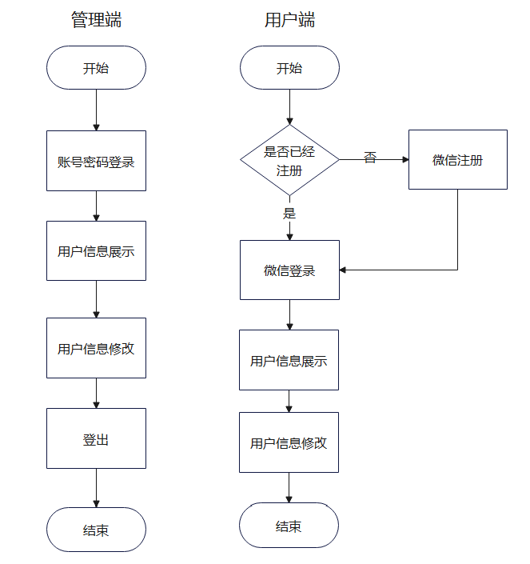
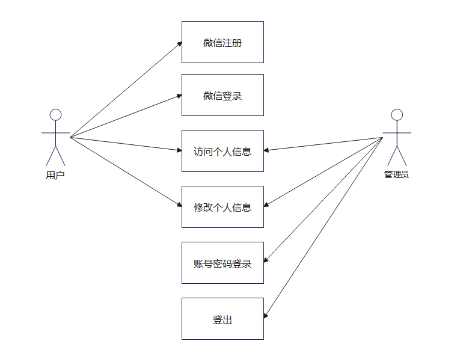
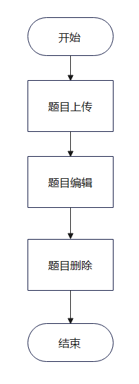
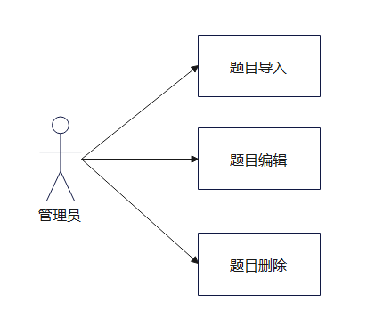
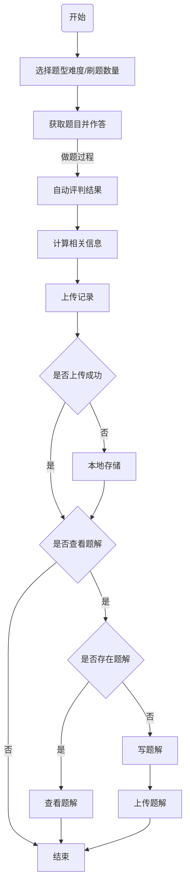
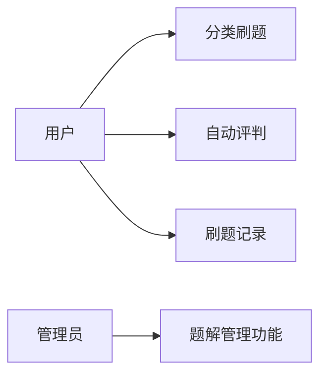
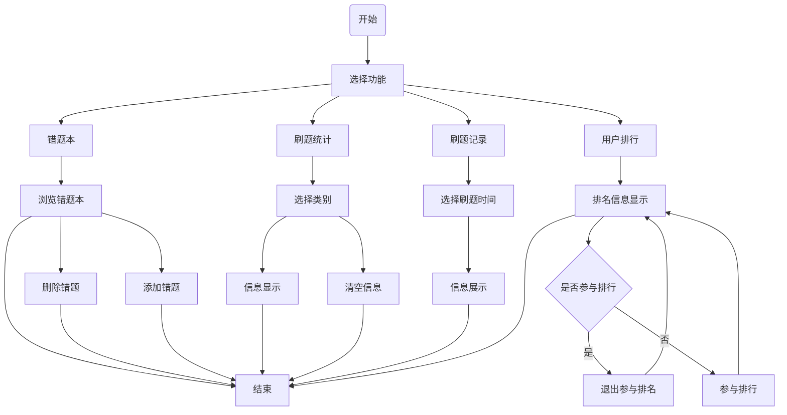
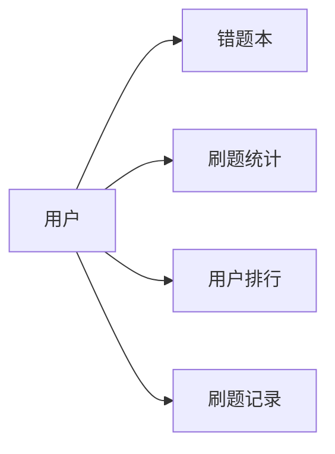

# Newbie English英语学习平台需求规格说明书

[TOC]

## 1 版本历史

| 日期       | 版本  | 人员                                             | 更新内容                                                     |
| ---------- | ----- | ------------------------------------------------ | ------------------------------------------------------------ |
| 2022.03.19 | V0.01 | 李霄龙 姜田龙 张昊雨                             | 后端创建文档                                                 |
| 2022.03.21 | V0.02 | 李霄龙 姜田龙 张昊雨                             | 后端完善总体内容                                             |
| 2022.03.22 | V0.03 | 李肇嘉 赵润晶                                    | 前端文档嵌入                                                 |
| 2022.03.23 | V0.10 | 李霄龙 姜田龙 张昊雨 徐乐陶 赵润晶 李肇嘉 杨佳豪 | 创建文档及目录，后端组大致完成任务，但仍有部分错误没有修订，图片风格没有统一 |
| 2022.03.24 | V0.2  | 李霄龙 姜田龙 张昊雨 徐乐陶 赵润晶 李肇嘉 杨佳豪 | 全部内容合入文档，进入最后修订                               |
|            |       |                                                  |                                                              |
|            |       |                                                  |                                                              |
|            |       |                                                  |                                                              |
|            |       |                                                  |                                                              |

## 2 前言

### 2.1 编写目的

基于对同类相关系统优势与不足的分析，以及小组成员的深入探讨，我们编写了此需求规格书。 该规格书明确了“Newbie English英语学习平台”的产品需求，细致描述了其主要功能模块，宏观给出了产品的整体框架，分析了产品面向的用户群体的主要特点，并提出了开发过程中潜在的非功能性需求。撰写该文档，旨在明确项目需求、合理安排项目规划与进度、有效组织软件开发与测试，该文档也提供了结项时的验收依据。 本文档面向的读者为软件工程课程组老师和助教（客户），项目管理人员、设计人员、 开发人员和测试人员，以及项目使用文档的编写者。

### 2.2 范围

本文档内容主要包括：

1）对项目背景、目标、设计约束等基本信息进行概述；

2）按功能性需求、非功能性需求分别对需求进行分析；

### 2.3 参考文档

| 序号 | 标题                   | 来源                               |
| ---- | ---------------------- | ---------------------------------- |
| 1    | 需求规格书模板         | 北航软件工程课程组                 |
| 2    | 需求规格说明书（示例） | 北航软件工程课程组（往届优秀作业） |

## 3 项目概述

### 3.1 项目背景

高中英语高考是教育部对高中生英语实力的综合性考核，通过听力，单项选择，语法填空，完形填空，阅读理解，写作等多个题目，从多个方面考验高中生的英语能力。

从高中走过来的 Newbie English 英语学习平台开发团队——反内卷软工小组深知高中生在填空、选择题部分的乏力，因此决定开发Newbie English英语学习平台，旨在给高中生们创造出来一个可以通过微信小程序打开，随时随地便可刷题的英语学习软件，市面上的英语学习平台针对性不强，我们使用过的一些平台都没有针对高考题目的刷题功能，因此这种英语学习小程序对高中生来说也许便捷且实用，在地铁，公交车上打开手机不再是社交软件和游戏视频，而是可以随手看两道英语真题。

### 3.2 项目目标

Newbie English英语学习平台项目的目标是搭建一个针对高中生高考英语学习的平台，为高中生在平时生活中对于英语真题的需求提供便利。本项目定位为致力于帮助高中生学习英语的公益系统，即不提供酬劳支付等交易类的功能。 

具体地，首先，系统预期提供用户的注册、登录、注销等用户管理功能。其次，针对具体类型题目，平台会展示出该类型题目的真题并且实时对作答进行评判。此外，为了确保高中生对自己的实力的了解，平台提供了数据分析以及图形化展示个人能力的功能，让用户快速了解自己的优劣题目类型。

### 3.3 需求范围

本文对需求范围的描述主要分为功能性需求和非功能性需求。 

在功能性需求方面，文档阐述了用户管理、项目管理、数据质量检测三个方面的需求。在非功能性需求方面则分为界面需求、性能要求、容量要求、组织需求、安全需求和法律需求六个方面进行叙述。

### 3.4 总体框架

	

### 3.5 用户特点

#### 3.5.1 操作人员

##### 3.5.1.1 管理人员

| 用户信息     | 具体情况                                 |
| ------------ | ---------------------------------------- |
| 用户身份     | 具有一定责任心的英语爱好者或专业英语老师 |
| 教育水平     | 本科及以上                               |
| 用户动机     | 希望使用平台帮助高中生用户学习英语       |
| 经典场景     | 将试卷提取并检查无误后上传到平台         |
| 预期使用频度 | 不超过1次/一周                           |
| 用户比例     | 5%                                       |

##### 3.5.1.2 使用人员

| 用户信息     | 具体情况                     |
| ------------ | ---------------------------- |
| 用户身份     | 在读高中生或参加高考的人     |
| 用户动机     | 希望使用平台帮助学习高考英语 |
| 经典场景     | 坐地铁打开小程序随时看两道题 |
| 预期使用频度 | 3次/天                       |
| 用户比例     | 90%                          |

#### 3.5.2 维护人员

| 用户信息     | 具体情况                                 |
| ------------ | ---------------------------------------- |
| 用户身份     | 具有一定水平的或经验的计算机专业人员     |
| 教育水平     | 本科及以上                               |
| 用户动机     | 致力于开发并维护该平台帮助高中生学习英语 |
| 技术专长     | 熟悉网站管理和维护                       |
| 预期使用频度 | 1次/天                                   |
| 用户比例     | 5%                                       |

## 4 功能性需求

### 	4.1 用户信息管理功能

#### 4.1.1 业务流程

	

#### 4.1.2 用例图

	

#### 4.1.3 功能点

##### 4.1.3.1 功能描述

###### 1、注册功能

用户直接微信授权注册即可。

用户名默认为微信号，头像默认为微信头像。

###### 2、登录功能

用户直接微信授权登录。

管理员在网页端需要账号密码登录。

###### 3、登出功能

此功能只针对管理端，就是退出登录，跳转到登录界面。

###### 4、用户信息展示功能

用户可在个人中心查看用户名、头像，还包括用户成绩分析、错题本。

管理员可查看所有用户的用户名、头像、刷题情况

###### 5、用户信息修改功能

用户可修改用户名、头像，编辑错题本、刷题记录。

管理员可删除用户

用户名的约束规则与微信号一致，不能以数字开头，可以使用6-20位字母、数字、下划线或减号组合而成，不支持中文。

##### 4.1.3.2 使用角色描述

| 角色   | 权限                         |
| ------ | ---------------------------- |
| 管理员 | 可以查看和修改所有用户的信息 |
| 用户   | 仅可以查看和修改自己的信息   |

##### 4.1.3.3 管理端输入

| 数据名称 | 数据格式               |
| -------- | ---------------------- |
| 账号     | 与微信号设置格式一致   |
| 密码     | 与微信密码设置格式一致 |

##### 4.1.3.4 用户端和管理端输出

| 模块             | 输出内容                           |
| ---------------- | ---------------------------------- |
| 管理端登录       | 登录成功，登录失败                 |
| 用户端注册和登录 | 注册/登录成功， 注册/登录失败      |
| 用户信息展示     | 用户名、头像，成绩分析、错题本入口 |
| 用户信息修改     | 修改成功，修改失败                 |

### 	4.2 题库管理系统

#### 4.2.1 业务流程

	

#### 4.2.2 用例图

	

#### 4.2.3 功能点

##### 4.2.3.1 功能描述

###### 1、题目上传

只允许管理员操作，支持文本格式的题目上传，可选择题目难度与题型。系统为每种题目，提供模板供管理员填写。选项部分，管理员可以直接一次性粘贴所有选项，再由系统自动识别出每个选项，也可手动录入每一个选项。

###### 2、题目编辑

管理员在上传题目后，仍可修改题目的标题、题干、选项、答案、题目难度、题型。

###### 3、题目删除

管理员可删除已经上传的题目。

##### 4.2.3.2 使用角色描述

| 使用者 | 功能                         |
| ------ | ---------------------------- |
| 管理员 | 题目上传、题目编辑、题目删除 |

##### 4.2.3.3 异常操作流程

上传、编辑题目时，不可出现某道题无题干、无答案等情况。管理员若填写有误，提交会被拒绝并收到提示，可返回继续编辑。

##### 4.2.3.4 输入

| 数据名称       | 数据格式 |
| -------------- | -------- |
| 阅读、完型标题 | 字符串   |
| 阅读、完型文章 | 字符串   |
| 阅读题干描述   | 字符串   |
| 选项           | 字符串   |
| 答案           | 字符     |

##### 4.2.3.5 输出

| 功能     | 输出                         |
| -------- | ---------------------------- |
| 上传题目 | 上传题目成功，题库中加入此题 |
| 编辑题目 | 编辑题目成功，题库中更新此题 |
| 删除题目 | 删除题目成功，题库中删除此题 |

### 	4.3 刷题功能

#### 4.3.1 业务流程

#### 4.3.2 用例图

#### 4.3.3 功能点

##### 4.3.3.1 功能描述

###### 1、分类刷题功能

用户可手动选择不同的难度，包括初中，高中，四六级，考研。

手动选择不同练习题型，包括选择题，完形填空，阅读理解。

系统随机在题库中从对应难度和题型中选出试题。

刷题过程中有如下信息显示：类型，用时，答对/总题数。

###### 2、自动评判功能

自动评测功能可以自动对用户提交的数据进行评判，并进行结果显示。

###### 3、题解功能

评判后，对于不懂的题目可以查看其他同学写出的题解.

作答完成后，可以为题目上传题解。

系统会对题解进行初步内容审核后发表。

题解设置点赞功能，同时会根据点赞数对题解进行排序。

###### 4、题解管理功能

管理员可以对与题目无关的题解进行删除。

##### 4.3.3.2 使用角色描述

| 使用者 | 功能                                 | 使用权限 |
| ------ | ------------------------------------ | -------- |
| 用户   | 分类刷题功能，自动评判功能，题解功能 | 权限低   |
| 管理员 | 题解管理功能                         | 权限高   |

##### 4.3.3.3 异常操作流程

分类刷题时，若题库已经被刷尽，会用户的错题、第二遍选择题库内题目进行选择。

自动评判时，若上传结果失败，先进行本地存储。

用户所写题解提交时被系统判定为血腥，暴力，色情，人身攻击，政治敏感，会收到系统提示，并可根据提示条目对题解进行编辑。

##### 4.3.3.4 输入

| 子功能模块 | 数据名称 | 数据格式   |
| ---------- | -------- | ---------- |
| 分类刷题   | 类型     | 字符串     |
| 分类刷题   | 题数     | 数字       |
| 自动评判   | 类型     | 字符串     |
| 自动评判   | 答对题数 | 数字       |
| 自动评判   | 总题数   | 数字       |
| 自动评判   | 用时     | 数字       |
| 自动评判   | 题号     | 字符串数组 |
| 题解       | 题解     | 字符串     |

##### 4.3.3.5 输出

| 功能     | 输出                                         |
| -------- | -------------------------------------------- |
| 分类刷题 | 查找题目成功并显示所有返回的题、查找题目失败 |
| 自动评判 | 评判成功、提交成功                           |
| 刷题记录 | 查询刷题记录成功、查询刷题记录失败           |

### 	4.4用户成绩分析功能

#### 4.4.1 业务流程

#### 4.4.2 业务流程

#### 4.4.3 功能点

##### 4.4.3.1 功能描述

###### 1、错题本功能

每个用户的错题本可以自动记录每次刷题产生的错题。用户可以手动添加题目进入错题本，或从错题本移出题目。

###### 2、刷题统计功能

用户可以查看自己的刷题总记录，可以根据分类或所有分类通过图表显示刷题数量、正确题数、正确率，可以清除自己在某分类或所有分类的数据。

###### 3、用户排行功能

用户可以查看总体、分类的用户排名，进入板块时还会显示您在服务器的排名比。用户可以选择自己是否参与总体、分类型的排名。

###### 4、刷题记录功能

后台会随时存储用户的刷题数据。

##### 4.4.3.2 使用角色描述

| 使用者 | 功能                                                 |
| ------ | ---------------------------------------------------- |
| 用户   | 错题本功能、刷题统计功能、用户排行功能、刷题记录功能 |

##### 4.4.3.3  异常操作流程

无。

##### 4.4.3.4 输入

| 子功能模块 | 数据名称 | 数据格式 |
| ---------- | -------- | -------- |
| 错题本     | 类型     | 字符串   |
| 错题本     | 题号     | 字符串   |
| 错题本     | 操作     | 字符串   |
| 刷题统计   | 请求     | 点击     |
| 用户排行   | 操作     | 字符串   |
| 用户排行   | 请求     | 点击     |
| 刷题记录   | 请求     | 点击     |

##### 4.4.3.5 输出

| 功能     | 输出                                                         |
| -------- | ------------------------------------------------------------ |
| 错题本   | 加入错题本成功、失败，移出错题本成功、失败                   |
| 刷题统计 | 请求成功，并配有图表信息显示                                 |
| 用户排行 | 查询排行成功、失败，取消加入排行成功、失败，加入排行成功、失败 |
| 刷题记录 | 查询刷题记录成功、查询刷题记录失败                           |

## 5 非功能性需求

在本节中主要描述项目所包含的非功能性方面的需求，包括界面需求、性能要求、容量要求、组织需求、安全需求和法律需求。

### 5.1 界面需求

界面需求分为管理端web页面以及用户端小程序页面两种，将分开在下文讲述。

#### 5.1.1 管理端web页面需求

##### 5.1.1.1 登录页面

该页面提供登录功能，通过用户名和密码完成验证，登陆完成之后自动跳转主页面。

##### 5.1.1.2 主页面

顶部导航栏：系统名称，注销按钮点击跳转到登录页面。点击公告编辑按钮跳转到公告编辑页面。

中栏：展示了题目各种分类，点击不同的分类名称可进入到不同题型的题目管理页面

底栏：展示小组名称，日期。

##### 5.1.1.3 题目管理页面

在该页面下展示题目标题，每个题有对应的删除按钮可以对题目进行删除操作，题目末尾可以显示发布人名称，点击题目标题即可跳转到题目详情页面查看题目详情。点击发布题目按钮即可进入题目发布页面。

##### 5.1.1.4 题目详情页面

该页面展示出题目标题，题目类别，题目内容，题目答案等具体详情。

##### 5.1.1.5 题目发布页面

在该页面可以发布题目，发布时填写的题目信息包括：

1) 题目标题
2) 题目类别
3) 题目内容
4) 题目答案
4) 发布人（非可填）

##### 5.1.1.6 公告编辑页面

在该页面可以编辑并发布公告，使之展示在小程序用户端。管理者可以随时编辑，更改公告，发布更新内容等。

#### 5.1.2 用户端小程序页面需求

##### 5.1.2.1 主页面

顶栏：本项目的名称。

中间栏：提供登录（链接到登录页面），注册（链接到注册页面）。

底栏：展示法律信息。

##### 5.1.2.2 登录页面

只支持微信登录，登陆完成之后自动跳转题库页面。

##### 5.1.2.3 注册页面

只支持微信注册，注册完毕后跳转登录界面，仍需要重新登陆。

##### 5.1.2.4 个人资料页面

该页面展示个人资料，包括用户名，头像，错题本（链接到错题本页面），用户排行（链接到用户排行页面），历史记录（链接到历史记录分析页面）。

##### 5.1.2.5 题库页面

该页面顶栏分为三个部分，分别为单项选择、阅读理解和完型填空三类题型，对应着三个副界面，每个副界面中对应着一种题型的题目列表，该列表按照上传时间排序，用户可直接自主选择题目开始练习，也可以选择快速开始，由系统随机选择题目。

##### 5.1.2.6 题目页面

该页面根据题目类型会有微小的不同，用户作答并提交后会进行自动评判并显示答案。

##### 5.1.2.7 错题本页面

在该页面下，用户可查看在练习中做错的题目，所有题目按照时间顺序排序。其中，对于阅读理解和完形填空这两种题型，错误的小题数超过一篇文章中总题数三分之一的，自动加入错题本。未超过三分之一的，也支持由用户自主加入错题本。

##### 5.1.2.8 历史记录分析页面

在该页面下，展示数个可视化图表，以反馈用户在不同题型中的答题情况，帮助用户了解自己的知识漏洞。

##### 5.1.2.9  用户排行界面

该页面展示的是使用该软件的用户的答题情况排名。该排行榜中只展示排名前一百的用户，排名在一百名以后的用户，也可以在页面底部查看到自己的排名。

### 5.2 性能需求

1)    操作系统兼容性

该项目具有操作系统无关性，用户端和管理端是相对独立的。

2)    并发处理能力

在所给的资源足够的情况下，在系统运行后，最多能容纳 300 次并发访问。从用户点击页面，到服务器对其响应的时间不超过 1s。

3)    可扩展性

该项目前后端的交互是高度模块化的，如果需要为系统添加新的功能，只需定义新的路由并完成页面设计即可。

### 5.3 容量要求

### 5.4 组织需求

系统中角色共有两种：管理员和用户。管理员可以在管理端（web）对于整个系统进行维护。管理端和用户端的账户信息分隔开（即管理员使用用户端需重新注册账号，该账号权限与普通用户相同）

### 5.5 安全需求

### 5.6 法律需求